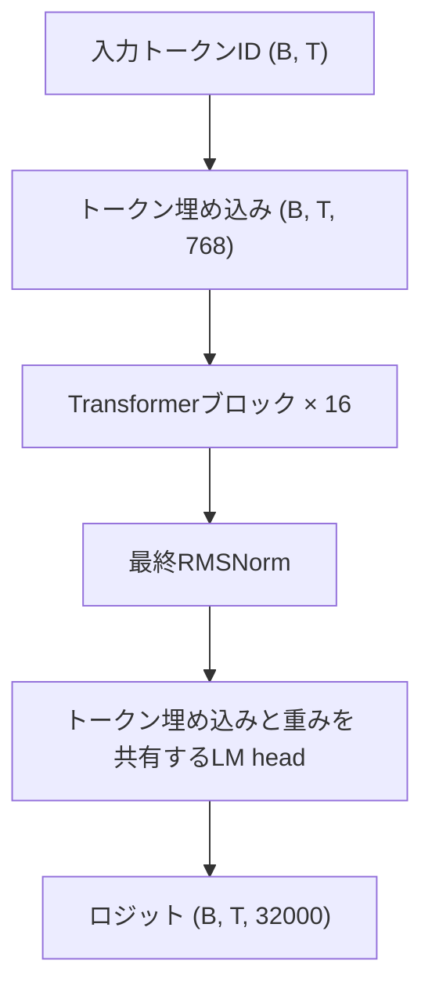

# SproutKO-130M

[English](README.md) · **日本語** · [한국어](README.ko.md)

SproutKO-130Mは、**129,983,232個の固有パラメータを持つ韓国語の事前学習済みdecoder-only Transformer**です。テキストの続きを生成する**ベースモデル**で、このリポジトリではPyTorch推論ランタイムを提供します。

- コード: [`project-iconik/SproutKO-130M`](https://github.com/project-iconik/SproutKO-130M)
- 重みとトークナイザー: [`project-iconik/SproutKO-130M`](https://huggingface.co/project-iconik/SproutKO-130M)
- リリース検証記録: [`release/VERIFICATION.md`](release/VERIFICATION.md)

**公開状況:** 現在、公開に向けて準備を進めています。以下のクローンとHubダウンロードの例は、リポジトリの公開を前提としています。プライベートリポジトリへのアクセスには、アクセス権限とローカルでの認証が必要です。

リリース設定に記録された学習量は、**106,812ステップ**、**7,000,031,232トークン**です。事前学習のシーケンス長は**2,048**です。

## クイックスタート

Python **3.10以上**とPyTorch **2.2以上**が必要です。パッケージのインストール時に、PyTorchとトークナイザー・Hub関連の依存パッケージもインストールされます。CUDAで推論する場合は、環境に合ったPyTorchを先にインストールしてください。

```bash
git clone https://github.com/project-iconik/SproutKO-130M.git
cd SproutKO-130M
python -m venv .venv
```

Linux/macOSでは、次のコマンドで仮想環境を有効にします。

```bash
source .venv/bin/activate
```

Windows PowerShellでは、次のコマンドを使用します。

```powershell
.venv\Scripts\Activate.ps1
```

ランタイムをインストールし、CPUでテキストを生成します。

```bash
python -m pip install .
sproutko-generate --checkpoint project-iconik/SproutKO-130M --prompt "한국어는" --max-new-tokens 64 --temperature 0 --device cpu
```

初回実行時に、Hugging Face Hubからモデルの重み、設定、トークナイザーをダウンロードします。以降はキャッシュ済みのファイルを再利用します。この3つのファイルとインストール済みのランタイムで推論を実行できます。

`--temperature 0`はgreedyデコーディングを使用します。サンプリングには、`--temperature 0.8 --top-k 50 --top-p 0.95 --seed 42`などのオプションを指定してください。CUDAでは`--device cuda`を使用します。デフォルトのデバイス選択はCUDA優先で、環境に応じてCPUで実行されます。

### Python API

```python
import torch
from sproutko import SproutKOForCausalLM, SproutKOTokenizer, generate

source = "project-iconik/SproutKO-130M"
model = SproutKOForCausalLM.from_pretrained(source)
tokenizer = SproutKOTokenizer.from_pretrained(source)

ids = torch.tensor([tokenizer.encode("한국어는")], dtype=torch.long)
output = generate(
    model,
    ids,
    max_new_tokens=64,
    temperature=0,
    eos_token_id=tokenizer.eos_token_id,
)
print(tokenizer.decode(output[0].tolist()))
```

この例はCPUで実行され、プロンプトと生成されたテキストをまとめて出力します。両方の`from_pretrained`ローダーは、`revision`、`token`、`cache_dir`に対応しています。特定のリリースに固定するには、両方のローダーに同じHubコミットのrevisionを指定してください。

### ローカルの重み

同じHubリリースから以下の3つのファイルをダウンロードし、`weights/`などのディレクトリに保存します。

| ファイル | 用途 |
| --- | --- |
| `config.json` | モデル構造とバンドルのファイル名 |
| `model.safetensors` | モデルの重み |
| `sproutko-tokenizer-32k-v1.json` | 語彙、マージ規則、内蔵トークナイザーバックエンド |

```bash
sproutko-generate --checkpoint ./weights --prompt "한국어는" --max-new-tokens 64 --temperature 0 --device cpu
```

ローカルバンドルはオフラインで読み込めます。Pythonでは、`source`にローカルディレクトリを指定してください。ソースリポジトリから実行する`python scripts/generate.py`も、`sproutko-generate`と同じ引数を受け取ります。重みはHugging Face Hubを通じて配布します。

## アーキテクチャ

Pre-Norm構造に、**RMSNorm**、**Rotary Position Embeddings（RoPE）**、**Grouped Query Attention（GQA）**、**SwiGLU**フィードフォワードネットワークを採用した因果デコーダーです。トークン埋め込みと出力射影は重みを共有します。生成時にはKVキャッシュを使ってトークンを逐次デコードします。



各ブロックは、RMSNorm → RoPEを適用したGQA → 残差加算 → RMSNorm → SwiGLU → 残差加算の順に処理します。

| 項目 | SproutKO-130M |
| --- | ---: |
| 固有パラメータ数 | 129,983,232 |
| 語彙サイズ | 32,000 |
| 隠れ層の次元 | 768 |
| Transformer層数 | 16 |
| Query / KVヘッド数 | 12 / 4 |
| ヘッド次元 | 64 |
| フィードフォワード中間次元 | 2,176 |
| プロンプトを含む最大生成シーケンス長 | 4,096 |
| 事前学習シーケンス長 | 2,048 |
| RoPE theta | 10,000 |
| RMSNorm epsilon | 1e-6 |
| トークン埋め込み・出力の重み共有 | 有効 |

`ModelConfig`には、他のモデルサイズの設定プリセットも用意されています。このリリースでは130Mの重みを提供します。

## トークナイザー

**SproutKO-Tokenizer-32K-v1**は、Rustの`tokenizers`ライブラリをバックエンドに使用する、独自の32,000トークンBPEトークナイザーです。JSONファイルに語彙、マージ規則、設定、バックエンドの状態が含まれています。

- Unicode NFC正規化と改行の統一を適用し、BOM文字を除去します。
- 学習済み語彙の範囲外の文字はbyte fallbackで処理します。
- 空白、タブ、改行を表現します。入力に含まれる特殊トークンの文字列と空白マーカーは、エンコード前にエスケープします。
- `encode()`は入力テキストのトークンIDを返します。`add_bos=True`で先頭にBOS、`add_eos=True`で末尾にEOSを追加できます。

| 特殊トークン | ID |
| --- | ---: |
| `<pad>` | 0 |
| `<s>` (BOS) | 1 |
| `</s>` (EOS) | 2 |
| `<unk>` | 3 |

重みとトークナイザーは、常に同じリリースのファイルを組み合わせて使用してください。独自形式のトークナイザーファイルは、`SproutKOTokenizer`で読み込みます。

## 検証

```bash
python -m pip install -e ".[dev]"
python -m pytest -q
python -m build
```

ローカルでの準備作業では、設定、生成、KVキャッシュの同等性、バンドルの読み込みを対象とした**31件のテスト**が成功しました。ソース配布物とwheelのビルドも成功しています。検証環境はWindows、Python **3.12.14**、PyTorch **2.14.0+cpu**です。

[リリース検証記録](release/VERIFICATION.md)には、元のランタイムと推論ランタイムの間で、トークナイザーの9サンプル、CPUロジット、12トークンのgreedy生成結果が一致したことが記録されています。参照値は[`release/parity.json`](release/parity.json)、バンドルのチェックサムは[`release/SHA256SUMS`](release/SHA256SUMS)にあります。

これらの検証は、ランタイムの一貫性を確認するものです。GPU推論と、公開リポジトリからの匿名ダウンロードから実行までの一連の手順は、検証待ちの項目です。

## ディレクトリ構成

- `sproutko/model/` — Transformer本体、因果言語モデル、KVキャッシュ
- `sproutko/tokenizer/` — トークナイザーの読み込み、正規化、BPE
- `sproutko/generation/` — 自己回帰生成とサンプリング
- `sproutko/pretrained.py` — ローカル・Hubバンドルのローダー
- `sproutko/cli.py` — インストールされる`sproutko-generate`コマンド
- `scripts/generate.py` — ソースリポジトリからの実行用エントリーポイント
- `tests/` — ランタイムのテスト
- `release/` — 検証記録、チェックサム、公開準備の案内

## 使用上の案内

- ベースモデルにテキストプロンプトを入力し、その続きを生成します。
- プロンプトには最低1トークンが必要です。プロンプトと要求する出力の合計長は最大**4,096トークン**です。学習時のシーケンス長は**2,048トークン**です。用途に応じた文脈長で出力品質を評価してください。
- safetensorsバンドルは`SproutKOForCausalLM`、トークナイザーは`SproutKOTokenizer`で読み込んでください。

## ライセンス

コード、配布する重み、トークナイザーは、**[Apache-2.0](LICENSE)**ライセンスで提供します。
