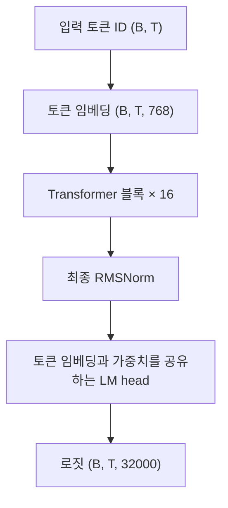

# SproutKO-130M

[English](README.md) · [日本語](README.ja.md) · **한국어**

SproutKO-130M은 **129,983,232개 고유 파라미터의 한국어 사전학습 decoder-only Transformer**입니다. 텍스트를 이어 쓰는 **기본 모델**이며, 이 저장소는 PyTorch 추론 런타임을 제공합니다.

- 코드: [`project-iconik/SproutKO-130M`](https://github.com/project-iconik/SproutKO-130M)
- 가중치와 토크나이저: [`project-iconik/SproutKO-130M`](https://huggingface.co/project-iconik/SproutKO-130M)
- 릴리스 검증 기록: [`release/VERIFICATION.md`](release/VERIFICATION.md)

**공개 상태:** 현재 공개를 준비하고 있습니다. 아래 복제 및 Hub 다운로드 예제는 저장소 공개를 전제로 합니다. 비공개 저장소에는 접근 권한과 로컬 인증이 필요합니다.

릴리스 설정에 기록된 학습량은 **106,812스텝**, **7,000,031,232토큰**입니다. 사전학습 시퀀스 길이는 **2,048**입니다.

## 빠른 시작

Python **3.10 이상**, PyTorch **2.2 이상**이 필요합니다. 패키지 설치 시 PyTorch와 토크나이저·Hub 의존성도 설치됩니다. CUDA 추론을 사용하려면 환경에 맞는 PyTorch를 먼저 설치하세요.

```bash
git clone https://github.com/project-iconik/SproutKO-130M.git
cd SproutKO-130M
python -m venv .venv
```

Linux/macOS에서는 다음 명령으로 가상환경을 활성화합니다.

```bash
source .venv/bin/activate
```

Windows PowerShell에서는 다음 명령을 사용합니다.

```powershell
.venv\Scripts\Activate.ps1
```

런타임을 설치하고 CPU에서 텍스트를 생성합니다.

```bash
python -m pip install .
sproutko-generate --checkpoint project-iconik/SproutKO-130M --prompt "한국어는" --max-new-tokens 64 --temperature 0 --device cpu
```

첫 실행 시 Hugging Face Hub에서 가중치, 설정, 토크나이저를 다운로드합니다. 이후에는 캐시된 파일을 재사용합니다. 이 세 파일과 설치된 런타임으로 추론을 실행할 수 있습니다.

`--temperature 0`은 greedy 디코딩을 사용합니다. 샘플링하려면 `--temperature 0.8 --top-k 50 --top-p 0.95 --seed 42` 등의 옵션을 지정하세요. CUDA에서는 `--device cuda`를 사용합니다. 기본 장치 선택은 CUDA 우선이며, 환경에 따라 CPU로 실행됩니다.

### Python API

```python
import torch
from sproutko import SproutKOForCausalLM, SproutKOTokenizer, generate

source = "project-iconik/SproutKO-130M"
model = SproutKOForCausalLM.from_pretrained(source)
tokenizer = SproutKOTokenizer.from_pretrained(source)

ids = torch.tensor([tokenizer.encode("한국어는")], dtype=torch.long)
output = generate(
    model,
    ids,
    max_new_tokens=64,
    temperature=0,
    eos_token_id=tokenizer.eos_token_id,
)
print(tokenizer.decode(output[0].tolist()))
```

위 예제는 CPU에서 실행되며 프롬프트와 생성된 텍스트를 함께 출력합니다. 두 `from_pretrained` 로더는 `revision`, `token`, `cache_dir`를 지원합니다. 특정 릴리스를 고정하려면 두 로더에 동일한 Hub 커밋 revision을 전달하세요.

### 로컬 가중치

동일한 Hub 릴리스에서 다음 세 파일을 다운로드하여 `weights/` 같은 폴더에 넣습니다.

| 파일 | 용도 |
| --- | --- |
| `config.json` | 모델 구조와 번들 파일명 |
| `model.safetensors` | 모델 가중치 |
| `sproutko-tokenizer-32k-v1.json` | 어휘, 병합 규칙, 내장 토크나이저 백엔드 |

```bash
sproutko-generate --checkpoint ./weights --prompt "한국어는" --max-new-tokens 64 --temperature 0 --device cpu
```

로컬 번들은 오프라인으로 불러올 수 있습니다. Python에서는 `source`를 로컬 폴더로 지정하세요. 소스 저장소에서 실행하는 `python scripts/generate.py`도 `sproutko-generate`와 같은 인자를 받습니다. 가중치는 Hugging Face Hub를 통해 배포합니다.

## 아키텍처

Pre-Norm 구조에 **RMSNorm**, **Rotary Position Embeddings(RoPE)**, **Grouped Query Attention(GQA)**, **SwiGLU** 피드포워드 네트워크를 사용하는 causal decoder입니다. 토큰 임베딩과 출력 프로젝션은 가중치를 공유합니다. 생성 시 KV 캐시를 사용하여 토큰을 순차적으로 디코딩합니다.



각 블록은 RMSNorm → RoPE를 적용한 GQA → 잔차 연결 → RMSNorm → SwiGLU → 잔차 연결 순서로 동작합니다.

| 항목 | SproutKO-130M |
| --- | ---: |
| 고유 파라미터 수 | 129,983,232 |
| 어휘 크기 | 32,000 |
| Hidden size | 768 |
| Transformer 레이어 수 | 16 |
| Query / KV head 수 | 12 / 4 |
| Head dimension | 64 |
| 피드포워드 중간 차원 | 2,176 |
| 프롬프트를 포함한 최대 생성 시퀀스 길이 | 4,096 |
| 사전학습 시퀀스 길이 | 2,048 |
| RoPE theta | 10,000 |
| RMSNorm epsilon | 1e-6 |
| 토큰 임베딩·출력 가중치 공유 | 사용 |

`ModelConfig`의 다른 모델 크기는 설정 프리셋입니다. 이 릴리스에서 제공하는 가중치는 130M입니다.

## 토크나이저

**SproutKO-Tokenizer-32K-v1**은 Rust `tokenizers` 라이브러리를 백엔드로 사용하는 자체 32,000토큰 BPE 토크나이저입니다. JSON 파일에 어휘, 병합 규칙, 설정, 백엔드 상태가 포함되어 있습니다.

- Unicode NFC 정규화와 줄바꿈 통일을 적용하고 BOM 문자를 제거합니다.
- 학습된 어휘 밖의 문자는 byte fallback으로 처리합니다.
- 공백, 탭, 줄바꿈을 표현합니다. 입력에 포함된 특수 토큰 문자열과 공백 마커는 인코딩 전에 이스케이프합니다.
- `encode()`는 입력 텍스트의 토큰 ID를 반환합니다. `add_bos=True`, `add_eos=True`로 시작·종료 토큰을 추가할 수 있습니다.

| 특수 토큰 | ID |
| --- | ---: |
| `<pad>` | 0 |
| `<s>` (BOS) | 1 |
| `</s>` (EOS) | 2 |
| `<unk>` | 3 |

가중치와 토크나이저는 항상 동일한 릴리스의 파일을 함께 사용하세요. 자체 토크나이저 파일은 `SproutKOTokenizer`로 불러옵니다.

## 검증

```bash
python -m pip install -e ".[dev]"
python -m pytest -q
python -m build
```

로컬 준비 과정에서 설정, 생성, KV 캐시 동등성, 번들 로딩을 다루는 **테스트 31개**가 통과했습니다. 소스 배포본과 wheel 빌드도 성공했습니다. 검증 환경은 Windows, Python **3.12.14**, PyTorch **2.14.0+cpu**입니다.

[릴리스 검증 기록](release/VERIFICATION.md)에는 원본 런타임과 추론 런타임 사이의 토크나이저 샘플 9개 일치, CPU 로짓 및 12토큰 greedy 생성 결과 일치가 기록되어 있습니다. 기준값은 [`release/parity.json`](release/parity.json), 번들 체크섬은 [`release/SHA256SUMS`](release/SHA256SUMS)에 있습니다.

위 검증은 런타임의 일관성을 확인합니다. GPU 추론과 공개 저장소의 익명 다운로드부터 실행까지의 전체 과정은 검증 대기 항목입니다.

## 폴더 구성

- `sproutko/model/` — Transformer 본체, causal LM, KV 캐시
- `sproutko/tokenizer/` — 토크나이저 로딩, 정규화, BPE
- `sproutko/generation/` — 자기회귀 생성과 샘플링
- `sproutko/pretrained.py` — 로컬·Hub 번들 로더
- `sproutko/cli.py` — 설치형 `sproutko-generate` 명령
- `scripts/generate.py` — 소스 저장소 실행 진입점
- `tests/` — 런타임 테스트
- `release/` — 검증 기록, 체크섬, 공개 준비 안내

## 사용 안내

- 기본 모델에 텍스트 프롬프트를 입력하여 이어질 내용을 생성합니다.
- 프롬프트에는 최소 한 개의 토큰이 필요합니다. 프롬프트와 요청한 출력 길이의 합은 최대 **4,096토큰**입니다. 학습 길이는 **2,048토큰**이며, 사용할 문맥 길이에 맞춰 출력 품질을 평가하세요.
- safetensors 번들은 `SproutKOForCausalLM`, 토크나이저는 `SproutKOTokenizer`로 불러오세요.

## 라이선스

코드, 배포 가중치, 토크나이저는 **[Apache-2.0](LICENSE)** 라이선스를 따릅니다.
