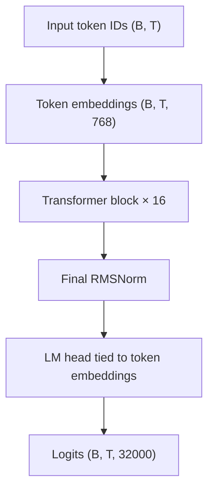

# SproutKO-130M

**English** · [日本語](README.ja.md) · [한국어](README.ko.md)

SproutKO-130M is a **Korean pretrained decoder-only Transformer** with **129,983,232 unique parameters**. It is a **base** model for text completion. This repository provides the PyTorch inference runtime.

- Code: [`sprout-research/SproutKO-130M`](https://github.com/sprout-research/SproutKO-130M)
- Weights and tokenizer: [`project-iconik/SproutKO-130M`](https://huggingface.co/project-iconik/SproutKO-130M)
- Release verification: [`release/VERIFICATION.md`](release/VERIFICATION.md)

The release configuration records **7,000,031,232 training tokens** at step **106,812**. The pretraining sequence length is **2,048**.

## Quick start

Python **3.10+** and PyTorch **2.2+** are required. Installation includes PyTorch and the tokenizer/Hub dependencies. For CUDA inference, install the appropriate PyTorch build for your environment first.

```bash
git clone https://github.com/sprout-research/SproutKO-130M.git
cd SproutKO-130M
python -m venv .venv
```

Activate the environment on Linux/macOS:

```bash
source .venv/bin/activate
```

Or on Windows PowerShell:

```powershell
.venv\Scripts\Activate.ps1
```

Install the runtime and generate text on CPU:

```bash
python -m pip install .
sproutko-generate --checkpoint project-iconik/SproutKO-130M --prompt "한국어는" --max-new-tokens 64 --temperature 0 --device cpu
```

The first run downloads the model weights, configuration, and tokenizer from Hugging Face Hub. Later runs reuse cached files. These three files and the installed runtime provide everything needed for inference.

`--temperature 0` uses greedy decoding. For sampling, use options such as `--temperature 0.8 --top-k 50 --top-p 0.95 --seed 42`. Use `--device cuda` for CUDA; omitting `--device` selects CUDA when available, otherwise CPU.

### Python API

```python
import torch
from sproutko import SproutKOForCausalLM, SproutKOTokenizer, generate

source = "project-iconik/SproutKO-130M"
model = SproutKOForCausalLM.from_pretrained(source)
tokenizer = SproutKOTokenizer.from_pretrained(source)

ids = torch.tensor([tokenizer.encode("한국어는")], dtype=torch.long)
output = generate(
    model,
    ids,
    max_new_tokens=64,
    temperature=0,
    eos_token_id=tokenizer.eos_token_id,
)
print(tokenizer.decode(output[0].tolist()))
```

This example runs on CPU and prints the prompt followed by generated text. Both `from_pretrained` loaders accept `revision`, `token`, and `cache_dir`. To pin a release, pass the same Hub commit revision to both loaders.

### Local weights

Download these three files from the same Hub release into a directory such as `weights/`:

| File | Purpose |
| --- | --- |
| `config.json` | Model architecture and bundle filenames |
| `model.safetensors` | Model weights |
| `sproutko-tokenizer-32k-v1.json` | Vocabulary, merges, and embedded tokenizer backend |

```bash
sproutko-generate --checkpoint ./weights --prompt "한국어는" --max-new-tokens 64 --temperature 0 --device cpu
```

Local bundle loading works offline. In Python, set `source` to the local directory. From a source checkout, `python scripts/generate.py` accepts the same arguments as `sproutko-generate`. Weights are distributed through Hugging Face Hub.

## Architecture

A causal decoder with pre-normalization, **RMSNorm**, **Rotary Position Embeddings (RoPE)**, **Grouped Query Attention (GQA)**, and a **SwiGLU** feed-forward network. Token embeddings and the output projection share weights. Generation uses a KV cache for incremental decoding.



Each block applies RMSNorm → GQA with RoPE → residual addition → RMSNorm → SwiGLU → residual addition.

| Property | SproutKO-130M |
| --- | ---: |
| Unique parameters | 129,983,232 |
| Vocabulary size | 32,000 |
| Hidden size | 768 |
| Transformer layers | 16 |
| Query / KV heads | 12 / 4 |
| Head dimension | 64 |
| Feed-forward intermediate size | 2,176 |
| Maximum generation sequence length, including prompt | 4,096 |
| Pretraining sequence length | 2,048 |
| RoPE theta | 10,000 |
| RMSNorm epsilon | 1e-6 |
| Tied word embeddings | Yes |

Other model sizes in `ModelConfig` are configuration presets only; this release supplies the 130M weights.

## Tokenizer

**SproutKO-Tokenizer-32K-v1** is a custom 32,000-token BPE tokenizer backed by the Rust `tokenizers` library. Its JSON artifact contains the vocabulary, merge rules, configuration, and backend state.

- Text is normalized to Unicode NFC and line endings are standardized. BOM characters are removed.
- Byte fallback covers characters outside the learned vocabulary.
- Spaces, tabs, and newlines are represented. Literal special-token strings and the space marker are escaped before encoding.
- `encode()` returns the input text's token IDs. Use `add_bos=True` to prepend BOS or `add_eos=True` to append EOS.

| Special token | ID |
| --- | ---: |
| `<pad>` | 0 |
| `<s>` (BOS) | 1 |
| `</s>` (EOS) | 2 |
| `<unk>` | 3 |

Always use weights and tokenizer files from the same release. Load the custom tokenizer artifact through `SproutKOTokenizer`.

## Verification

```bash
python -m pip install -e ".[dev]"
python -m pytest -q
python -m build
```

Local preparation checks passed **31 tests** covering configuration, generation, KV-cache equivalence, and bundle loading. Source and wheel distributions built successfully. The verified environment is Windows, Python **3.12.14**, and PyTorch **2.14.0+cpu**.

The [release verification record](release/VERIFICATION.md) documents tokenizer parity on nine samples and matching CPU logits and 12-token greedy output between the original and inference runtimes. Reference values are in [`release/parity.json`](release/parity.json), and bundle checksums are in [`release/SHA256SUMS`](release/SHA256SUMS).

These checks establish runtime consistency. GPU inference and an end-to-end anonymous download from the public repositories are pending verification.

## Layout

- `sproutko/model/` — Transformer backbone, causal LM, and KV cache
- `sproutko/tokenizer/` — tokenizer loading, normalization, and BPE
- `sproutko/generation/` — autoregressive generation and sampling
- `sproutko/pretrained.py` — local and Hub bundle loaders
- `sproutko/cli.py` — installed `sproutko-generate` command
- `scripts/generate.py` — source checkout entry point
- `tests/` — runtime tests
- `release/` — verification records, checksums, and publication notes

## Usage notes

- Use a text prompt for completion with this base model.
- Prompts must contain at least one token. The combined prompt and requested output length is limited to **4,096 tokens**. Training used **2,048-token** sequences; evaluate output quality for your intended context length.
- Load the safetensors bundle through `SproutKOForCausalLM` and the tokenizer through `SproutKOTokenizer`.

## License

Code, exported weights, and tokenizer are licensed under **[Apache-2.0](LICENSE)**.
