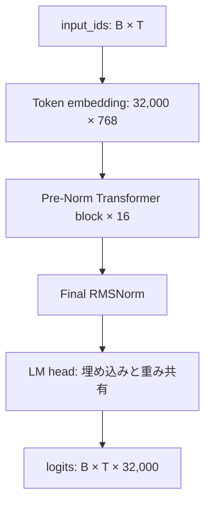
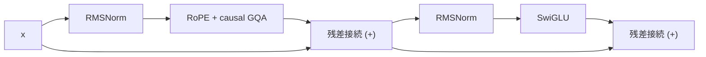
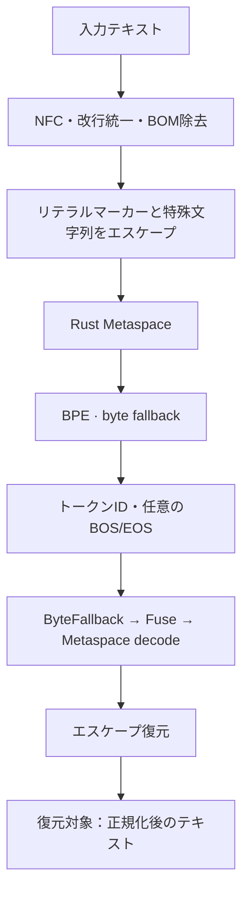
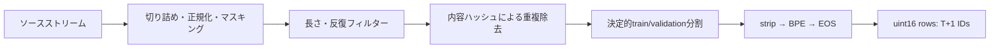
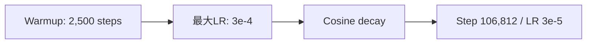

# SproutKO-130M 技術白書

[한국어](WHITEPAPER.ko.md) · [English](WHITEPAPER.md) · **日本語**

## 韓国語を中心とする32Kトークナイザーと小規模言語モデルの事前学習

**日本語 · 技術レビュー版 v0.2 · 2026-09-09**

| 項目 | 内容 |
|---|---|
| 著者・所属 | 最終出版版で確定 |
| プロジェクト / パッケージ | SproutKO-130M / `sproutko` 0.1.0 |
| モデル | 固有パラメータ数129,983,232の事前学習済みベースモデル |
| トークナイザー | `sproutko-tokenizer-32k-v1`, release 1.0.0 |
| 学習実行 | `sproutko_130m_24gb/20260903T033724Z` |
| 最終チェックポイント | `step_106812.pt` |
| 学習処理量 | 7,000,031,232 next-token targets |
| 対象範囲 | 実装、保存済みの学習・評価記録、ローカルエクスポート、再現性 |

本白書では、SproutKO-130Mのモデル構造、トークナイザー、データ処理、事前学習、韓国語評価を記述する。数値は保存済みの実行結果とファイルの検算に基づく。コード・実験の根拠S1–S15は[付録D](#appendix-d)、原論文とデータセットの出典は[参考文献](#references)に示す。

## 目次

1. [要旨](#abstract)
2. [序論](#introduction)
3. [関連研究](#related-work)
4. [モデル](#model)
5. [トークナイザー](#tokenizer)
6. [データ](#data)
7. [事前学習](#training)
8. [計算資源](#compute)
9. [言語モデルの結果](#lm-results)
10. [韓国語評価](#evaluation)
11. [生成と利用](#generation)
12. [制約と利用条件](#limitations)
13. [再現性](#reproducibility)
14. [結論](#conclusion)
15. [参考文献](#references)
16. [付録](#appendix-a)

---

<a id="abstract"></a>
## 1. 要旨

SproutKO-130Mは、韓国語を中心とするテキストの次トークン予測を目的として、スクラッチから事前学習した**固有パラメータ数129,983,232**のdecoder-only Transformerである。語彙数32,000の専用BPEトークナイザーを使用し、16個のPre-NormブロックにRMSNorm、RoPE、grouped-query attention（GQA）、SwiGLUを採用する。入力埋め込みと出力LM headは重みを共有する。

保存済みのproduction実行では、単一のNVIDIA RTX PRO 4500 Blackwell上で、系列長2,048、micro-batch 2、gradient accumulation 16、BF16の設定により106,812 optimizer stepを実行した。処理した次トークン予測ターゲットは**7,000,031,232個**で、固有パラメータ当たり約**53.85個**に相当する。記録された実行時間は**34.48時間**、最後に記録された学習損失は3.1664だった。評価バッチ数を限定したvalidationの最終交差エントロピーとperplexityは、それぞれ**3.1094**、**22.4076**だった。[S1–S3, S13]

KoBEST validationのローカルzero-shot評価では、5タスクの正解率の単純平均が**51.21%**となり、COPAで59.40%、HellaSwagで48.20%を記録した。別の診断では、BoolQとWiCの予測が一方の回答に集中する傾向を確認した。この2タスクにドメイン条件付きPMI補正を適用した研究用の複合平均は**52.02%**だった。同じモデル重みに対して採点方法を補正した結果である。[S7, S8]

本白書は、韓国語専用トークナイザーと小規模ベースモデルの構築に関する実装・実験記録を提供する。今後の研究では、トークナイザー比較、4,096トークンの長文評価、設計要素ごとの性能分析を扱う。

<a id="introduction"></a>
## 2. 序論

本プロジェクトは、韓国語テキスト専用の語彙とトークン化方針を構成し、約130Mパラメータの言語モデルに適用する取り組みである。ハングル音節と字母、分かち書き、韓英混在、数字・記号の表現単位を定め、学習に利用する単一のトークンID体系へ結び付けることを主要な設計課題とする。

専用トークナイザーは、Hugging FaceのRust `tokenizers`バックエンドに、プロジェクト固有の語彙・マージ規則、正規化、空白処理、特殊文字列のエスケープ、byte fallback方針を組み合わせた構成である。学習成果物を凍結し、モデル設定とチェックポイントが同じtokenizer fingerprintを参照するよう管理する。[S5, S6]

本白書では、実装済みモデルと凍結トークナイザーの構造、完了した1回の7B事前学習、韓国語評価の結果、回答選択の偏りを扱う。設計目的を説明し、観測された性能をタスク別に分析する。

本モデルは、次トークン予測で学習した**事前学習済みベースモデル**である。研究、構造分析、継続事前学習、ファインチューニングの出発点としての利用を想定する。[S11]

<a id="related-work"></a>
## 3. 関連研究

モデルは、self-attentionと位置ごとのfeed-forward層を基本演算とするTransformerに基づく。本実装は、因果的attentionを用いるdecoder-only構造である。[Vaswani et al., 2017](https://arxiv.org/abs/1706.03762)

GQAは、複数のquery headが少数のkey/value headを共有する構成である。SproutKOはquery headを12個、KV headを4個使用する。位置情報をRoPEでQ・Kに反映し、正規化にRMSNorm、feed-forwardにSwiGLUを用いる。[Ainslie et al., 2023](https://arxiv.org/abs/2305.13245), [Su et al., 2021](https://arxiv.org/abs/2104.09864), [Zhang and Sennrich, 2019](https://arxiv.org/abs/1910.07467), [Shazeer, 2020](https://arxiv.org/abs/2002.05202)

subword学習にはBPE方式を用いる。希少語を部分単位で表現する手法は、Sennrichらの研究に対応する。SproutKOで扱う貢献範囲は、韓国語中心の標本から学習した32K語彙と、その処理・凍結方針である。[Sennrich et al., 2016](https://aclanthology.org/P16-1162/)

韓国語評価には、5つの韓国語タスクからなるKoBESTを使用する。本白書の結果は、このリポジトリのvalidation・zero-shot・正解率プロトコルで算出した値である。[Jang et al., 2022](https://aclanthology.org/2022.coling-1.325/)

<a id="model"></a>
## 4. モデル

### 4.1 構成

| 項目 | 値 |
|---|---:|
| 固有パラメータ数 | 129,983,232 |
| 語彙数 / hidden size | 32,000 / 768 |
| Transformerブロック数 | 16 |
| Query / KV head数 | 12 / 4 |
| Head次元 / KV head当たりのquery head数 | 64 / 3 |
| SwiGLU中間層サイズ | 2,176 |
| 正規化 | RMSNorm, epsilon 1e-6 |
| 位置表現 | RoPE, theta 10,000 |
| Attention / MLP射影のバイアス | 省略 |
| 入力・出力埋め込みの共有 | 有効 |
| 事前学習長 / 設定上の文脈長 | 2,048 / 4,096 |

パラメータ数は共有埋め込みを1回として数える。モデル設定と射影次元から算出した合計は129,983,232である。ローカルsafetensorsのヘッダーからshapeを合算し、重複保存されたLM headを除いた場合も同じ値になる。[S11, S13]



図1. モデル全体の構造。Bはバッチサイズ、Tは入力長を表す。RoPEはattentionのQ・Kに位置情報を与える。

### 4.2 Transformerブロック

各ブロックは、以下の2つの残差演算を順に実行する。attentionとMLPへの入力を正規化し、それぞれの残差経路を加算する。

```text
h = x + Attention(RMSNorm(x))
y = h + SwiGLU(RMSNorm(h))
SwiGLU(z) = W_down [SiLU(W_gate z) ⊙ (W_up z)]
```



図2. Pre-Normブロック。MLPのgate・up・down射影とattentionのQ・K・V・O射影は、すべてバイアス項を省いた線形変換である。[S11]

### 4.3 AttentionとKV cache

Qのshapeは`B × 12 × T × 64`、K・Vは`B × 4 × T × 64`である。KV cacheにはRoPE適用後のKと値テンソルVを保存する。query headごとにK・Vを保持する12-head MHAに対し、同じB・T・dtypeでのキャッシュ要素数は1/3となる。この比率は、バッチサイズ・長さ・dtypeを揃えたキャッシュテンソルの要素数から算出した。

現行attention実装には、PyTorch scaled dot-product attentionと明示的なattention演算の経路がある。SDPAでは`dropout_p=0.0`を使用し、利用可能なAPI・デバイスに応じてGQA対応経路またはKV head拡張経路を選択する。[S11]

生成では、プロンプト全体を処理するprefillに続き、1トークンずつdecodeする。新しいQ・Kの位置はキャッシュの過去長から続き、KはRoPEを1回適用した状態で保存する。設定値4,096は、生成長の検査とキャッシュ容量にも使用する。4,096トークンでの品質は、今後の長文評価で扱う。

### 4.4 初期化と精度

Linear・embeddingの重みは標準偏差0.02の正規分布で初期化し、RMSNormの重みは1で開始する。attention出力射影とMLP down射影には`0.02 / sqrt(2 × 16)`を用いる。現行実装はRMSNormの二乗平均とRoPE回転をFP32で計算し、必要な箇所で入力dtypeに戻す。学習にはFP32重みとBF16 autocastを組み合わせる経路がある。[S3, S11]

<a id="tokenizer"></a>
## 5. トークナイザー

### 5.1 実際の処理経路

凍結済みv1は`rust_bpe`バックエンドを使用する。NFC正規化、CRLF・CRからLFへの統一、BOM除去を行う。リテラルの`▁`、エスケープ文字U+F0000、4つの特殊トークン文字列は、内部マーカーと区別できるようエスケープする。Rust Metaspaceは空白マーカーに`▁`を用い、`prepend_scheme="never"`に設定する。[S5, S6]



図3. 凍結トークナイザーの処理経路。モデルは、この経路で得たトークンIDを埋め込み層の入力として使用する。

復元の基準は、**正規化後のテキストとdecode結果の一致**である。例えば、CRLFはLFに、分解されたハングルはNFCの合成済み音節に変換される。BOS/EOSの追加はencode引数で制御し、文書パッキングではEOSを追加する。

| 特殊トークン | ID | 役割 |
|---|---:|---|
| `<pad>` | 0 | Padding |
| `<s>` | 1 | BOS |
| `</s>` | 2 | EOS |
| `<unk>` | 3 | UNK |

### 5.2 語彙構成と学習方針

| 相互排他的な語彙分類 | 個数 |
|---|---:|
| 特殊トークン | 4 |
| Byte fallbackトークン | 256 |
| 基本alphabet | 8,000 |
| 学習済みsubword | 23,740 |
| **合計** | **32,000** |

既存の静的監査では、基本ハングル音節を2,023個と集計している。設定の`base_hangul_count`は2,350であり、凍結語彙の音節数には上記の静的集計値を用いる。凍結ファイルのcontrol tokenとplaceholder tokenは、それぞれ0個である。[S5, S14]

語彙全体では、ハングルを含むトークンが12,907個、ラテン文字を含むトークンが11,450個、空白マーカーを含むトークンが14,860個ある。これらは重複を許す文字群別の包含数である。入力の圧縮効率は文字数/トークン数で評価する。[S14]

現行のRust学習コードは、`min_frequency=2`、`limit_alphabet=8000`、`max_token_length=32`を使用する。ASCII・互換字母・空白マーカーを初期alphabetに含め、語彙とマージ規則を学習する。標本抽出にはソース別の文字数予算と文書IDのハッシュを用いる。トークナイザー学習標本のソース比率はsampling manifestで管理する。[S6]

### 5.3 凍結と品質記録

トークナイザーは2026-09-02 20:18:02 UTCに`IMMUTABLE_FINAL`として凍結された。manifestには`tokenizers` 0.23.1、train・validation標本のハッシュ、sampling manifestのハッシュ、quality reportのパスが記録されている。以下は**凍結manifestに保存された評価要約**である。詳細標本とquality reportの確保は、今後の資料補完項目となる。[S5]

| 指標 | 記録値 | 意味と範囲 |
|---|---:|---|
| 文字数/トークン数 | 3.1423 | コード上の入力文字列長の合計 / encode長の合計 |
| Byte fallbackトークン率 | 0.1308% | 出力IDに占めるbyte tokenの割合 |
| 語彙利用率 | 84.49% | 標本で使用したusable IDの割合 |
| Roundtrip失敗数 | 0 | 当該標本の正規化文の復元失敗 |
| UNKトークン数 | 0 | 当該評価で観測されたUNK |
| Unreachableトークン数 | 0 | 現行audit定義による構造検査 |
| 内部quality gate | GO | プロジェクトの凍結基準を通過 |

現行freezeコードの`corpus_characters=119,553,175`は、学習用に選択した文字数に対応するフィールドである。語彙利用率の分母は4つの特殊トークンとplaceholderを除いた数で、v1では31,996となる。byte tokenはこの分母に含む。

現行のunreachable検査では、単一文字とマージ結果の構造を確認する。roundtrip失敗数は、評価に用いた標本に対して集計する。新しい標本での測定は、既存manifestと併せて、測定日を区別した結果として管理する。[S6, S14]

### 5.4 記録されたトークン化の例

別の推論バンドルに保存されたCPU同等性記録には、以下の例が含まれる。保存済みの`parity.json`から引用した例である。[S9]

| 入力 | 本文トークンID | 復元 |
|---|---|---|
| `한국어는` | `[11423, 12925]` | `한국어는` |
| `안녕하세요. 오늘 날씨가 좋습니다!` | `[26928, 15009, 10444, 9661, 17359, 9045, 27692]` | 入力と同一 |

32K埋め込みのパラメータ数は24,576,000で、全体の約18.91%を占める。語彙サイズは埋め込みのパラメータコストに直結する。今後の研究では、16K・32K・48Kのコストと性能を比較する。

<a id="data"></a>
## 6. データ

### 6.1 ソース定義と目標配分

| 領域 | コードに定義されたソース・フィールド | Ticket配分 |
|---|---|---:|
| 韓国語 | FineWeb-2 `kor_Hang/text` → FineWiki `ko/text` → 文法seed | 190 / 200 = 95% |
| 英語 | FineWeb `text` | 5 / 200 = 2.5% |
| コード | `jtatman/python-code-dataset-500k`, `output` | 3 / 200 = 1.5% |
| 数学 | FineMath `finemath-4plus/text` | 2 / 200 = 1% |

これは**ソースストリームの設計上の配分**である。実際の学習トークン比率は、文書長、フィルター通過率、ソースの枯渇、パッキングの停止位置によって変わる。韓国語ストリームは3ソースを順に連結するため、FineWikiとseedが最終パッキングに含まれたかをメタデータで確認する必要がある。ソース別の実際の寄与率は、最終パッキングメタデータから追加集計する項目である。[S4]

FineWeb-2は多言語Webコーパスで、FineWikiはWikipedia由来のデータである。各ソースの性質はデータセットカードに記載されている。学習時点のrevisionは、実行provenanceの補完項目である。[FineWeb-2カード](https://huggingface.co/datasets/HuggingFaceFW/fineweb-2)、[FineWikiカード](https://huggingface.co/datasets/HuggingFaceFW/finewiki)

コードデータの処理経路は、`output`フィールドのテキストを読み取り、事前学習ストリームへ投入する。[S4]

### 6.2 前処理・重複除去・分割

現行コーパス実装は、長い文書を最大50,000文字に切り詰め、正規化と一部の機微情報パターンのマスキングを行う。長さや反復文字率などを確認し、メールアドレス・電話番号・韓国の住民登録番号形式・口座番号形式・一部のAPI keyパターンをplaceholderに置換する。これは正規表現を用いたテキストマスキングである。

重複除去には、処理後テキストのSHA-256を使用する。内容ハッシュの先頭8桁の16進数を整数に変換し、validationの閾値と比較してsplitを決める。混合定義のvalidation比率は0.015である。この方式は、同じ処理済みテキストの完全重複を管理する。類似文書や評価設問との重複分析は、今後のデータ監査で扱う。[S4]



図4. 現行の処理パイプライン。レビュー時点のHEADを示し、学習記録のSHA以降に追加されたtoken-budget top-up機能を含む。当時の実行フローの復元には、その時点のコードdiffと最終manifestが必要である。

### 6.3 パッキングと処理量

32KのトークンIDはuint16に保存する。各行はT+1個のIDを持ち、先頭T個を入力、末尾T個を次トークンのlabelとする。隣接行は1個のIDを共有し、予測ターゲットを連続させる。CE関数は、この入力・labelの対応をそのまま使用する。[S4, S3]

文書のエンコードには`add_bos=False`、`add_eos=True`を使用する。パッキング段階では、トークナイザーAPIとは別の処理として入力に`strip()`を適用する。EOSは文書境界を表す。同じ行の後続文書は、因果的attentionを通して先行文書を参照できる。

| 記録された集計 | Train | Validation |
|---|---:|---:|
| `total_documents` | 9,714,224 | 149,369 |
| パッキング済み系列数 | 3,417,984 | 52,051 |
| 次トークン予測ターゲット数 | 7,000,031,232 | 106,600,448 |
| 系列長 | 2,048 | 2,048 |

これらは`data_stats.json`の集計値である。`total_documents`の集計単位は、パッキングへの入力項目となる。現行text-shard readerは内容のある行を1項目として読み取り、binary writerはエンコードした項目を数える。元文書の境界との対応付けには、元のsidecarメタデータが必要である。[S2, S4]

trainのpacked sequence数は`106,812 × 2 × 16`と一致する。現行trainerは、各epochで`seed + epoch`を用いてシャッフルする。この規模は、packedデータの1 epoch分のバッチ数に対応する。

<a id="training"></a>
## 7. 事前学習

### 7.1 目的関数とoptimizer

学習では、次トークンの平均負の対数尤度を最小化する。loss計算はlogitsをFP32に変換し、`ignore_index=-100`を適用する。gradient accumulationでは、micro-batchの平均lossに有効ターゲット数を掛けて逆伝播し、蓄積した有効ターゲット総数でgradientを割る。有効長が異なるバッチも、トークン数に基づいて重み付けされる。[S3]

AdamWは、重み減衰を適応的gradient updateから分離する。本実装は行列パラメータに減衰を適用し、norm・biasなどの1次元パラメータ群を対象外として、共有パラメータを1回登録する。行列パラメータは129,957,888個、RMSNormパラメータは25,344個である。[Loshchilov and Hutter](https://arxiv.org/abs/1711.05101)、[S3, S11]

### 7.2 実行設定

| 設定 | 記録値 |
|---|---:|
| 乱数seed | 42 |
| 系列長 | 2,048 |
| Micro-batch / gradient accumulation | 2 / 16 |
| Optimizer step当たりのターゲット数 | 65,536 |
| 最大step数 | 106,812 |
| Optimizer | AdamW |
| 学習率 / 最小値 | 3e-4 / 3e-5 |
| Warmup / 後続schedule | 2,500 step / cosine decay |
| Betas / epsilon | (0.9, 0.95) / 1e-8 |
| 重み減衰 | 0.1 |
| Gradient clippingのノルム | 1.0 |
| 計算精度 | BF16 |
| 学習ログ間隔 | 10 stepごと、および最初のstep |
| Validation間隔 | 500 stepごと、および最終step |
| Validation最大バッチ数 | 256 |
| チェックポイント間隔 | 500 stepごと、および最終step |
| 直近のチェックポイント保持数 | 8 |

表は`config.snapshot.json`に明記された項目を示す。現行`TrainingConfig`の既定値は`torch_compile=false`、`gradient_checkpointing=false`であり、当時の実行値は追加確認項目である。[S3]



図5. 学習率scheduleの概要。初期化と`scheduler.step()`のタイミングにより、実際のupdateに使うLRと記録時点のLRに差が生じるため、正確な値はログと実装に従う。

### 7.3 チェックポイントと復元

チェックポイントは、モデル・optimizer・schedulerの状態、RNG、step、処理量、tokenizer fingerprint、データ進行状態などを保存する。現行実装は一時ファイルとatomic replaceを使用し、復元時にトークナイザーとpacked datasetのfingerprintを確認する。resumeテストは、状態復元の限られたケースを対象とする。[S3]

実行記録には、working treeがdirty状態だったことが示されている。当時の実行を復元するには、記録されたSHAとともに、未コミットの変更、データ、環境を確保する必要がある。本白書の学習結果は、1回のproduction実行に対応する。

<a id="compute"></a>
## 8. 計算資源

| 項目 | 保存記録 |
|---|---|
| GPU | NVIDIA RTX PRO 4500 Blackwell, 1基 |
| 報告されたVRAM | 約31.37 GiB、元フィールド名 `total_vram_gb` |
| OS / Python | Linux / 3.13.8 |
| PyTorch | 2.14.0+cu130 |
| CUDA runtime / driver | 13.0 / 580.126.20 |
| 実行時間 | 124,110.48秒 = 34.4751時間 |
| 処理量 / 記録時間 | 56,401.61 target/s |
| ログ観測時の最大allocated | 1,827.25 MiB |
| ログ観測時の最大reserved | 7,392.00 MiB |

環境文字列は、当時の`environment.json`に保存された記録である。時間と平均処理量は`final_summary.json`から再計算した。[S1, S13]

現行trainerのelapsedは学習ループの開始から終了までを測り、定期validationとチェックポイント保存を含む。データ収集・トークナイザー学習・パッキングは事前準備に当たる。平均処理量は、評価と保存を含む学習ループのelapsedを基準とする。resume実行では、累積ターゲット数と今回の実行時間の対応を別途確認する必要がある。[S3]

メモリ値は、train logの記録時点で`memory_allocated()`と`memory_reserved()`から取得した値である。各観測時点のallocator状態を表す。実際のpeak allocationと最小必要VRAMは、今後の計測項目となる。使用GPUの容量は、上記の環境記録に従う。

<a id="lm-results"></a>
## 9. 言語モデルの結果

### 9.1 学習曲線

| 指標 | 値 | 観測step |
|---|---:|---:|
| 初回train loss | 10.5257 | 1 |
| 最終記録train loss | 3.1664 | 106,810 |
| 最低・最終val CE | 3.1094 | 106,812 |
| 最低・最終val PPL | 22.4076 | 106,812 |
| 最終処理targets | 7,000,031,232 | 106,812 |

32,000語彙の一様分布に対するCEは`ln(32,000) ≈ 10.3735`である。最初の学習lossは、この基準に近い10.5257から始まる。最後のtrain lossの記録は、終了の2 step前に当たる106,810である。train recordは10,682件、validation recordは214件ある。[S2, S13]


図6. 保存済みのtrain・validation loss曲線。入力データと集計条件が異なる観測値である。


図7. 最大256バッチのvalidationで記録したperplexity。

### 9.2 Validationの範囲

現行`evaluate()`はvalidationを固定順序で読み取り、最大256バッチで終了する。micro-batch 2、系列長2,048の場合、上限は**1,048,576ターゲット**となる。保存されたvalidation全体は106,600,448ターゲットである。1,048,576は設定から算出した評価量の上限で、実際の有効ターゲット数は追加確認項目である。[S2, S3]

PPLは平均CEの指数関数で求める。CEとPPLは個別に丸めて記録されるため、`exp(3.1094)`を再計算すると、保存されたPPLと末尾の桁がわずかに異なる場合がある。本白書ではログの22.4076を使用する。

lossの低下は、次トークン予測の目的関数の改善を示す。今後の評価では、最終重みのfull-validationとチェックポイント別のdownstream性能を測定する。

<a id="evaluation"></a>
## 10. 韓国語評価

### 10.1 データと採点プロトコル

保存済みのraw評価は、`skt/kobest_v1` validationでzero-shotとして実施された。各モデルは固有のトークナイザーを使用し、文脈に続く選択肢のトークン平均対数尤度が最大となる選択肢を選ぶ。本白書の**rawは、トークン平均LLに基づくPMI補正前の採点**を意味する。[S7]

| タスク | 選択肢 | 設問数 | 一様ランダム基準 |
|---|---|---:|---:|
| BoolQ | `아니오`（いいえ） / `예`（はい） | 700 | 50% |
| COPA | 原因・結果の選択肢2個 | 500 | 50% |
| HellaSwag | 後続文4個 | 500 | 25% |
| SentiNeg | `부정`（否定的） / `긍정`（肯定的） | 400 | 50% |
| WiC | `다르다`（異なる） / `같다`（同じ） | 610 | 50% |

`encode_pair()`は文脈と選択肢を結合してエンコードし、文脈のみのエンコード結果との最長共通prefixを求める。選択肢の結合によりBPE境界の最後の文脈トークンが変化すると、その位置から採点する。安定したprefixの長さが0の場合は、BOSを付けて再試行する。長さの超過時には選択肢を保持しながら文脈の左側を切り詰め、選択肢自体が長すぎる場合は失敗として扱う。同点では小さいindexを選ぶ。[S7]

```text
score(choice | context) = mean(log p(scored token | preceding tokens))
prediction = argmax_choice score(choice | context)
macro accuracy = (BoolQ + COPA + HellaSwag + SentiNeg + WiC) / 5
```

SproutKOの原本結果では、すべてのタスクのskippedが0である。比較モデルの原本も集計表と照合した。評価コードはCUDA BF16対応状況に応じてautocastを選択する。比較には共通の採点コードを用い、当時のGPU・dtype・ライブラリ・dataset revisionはprovenanceの補完項目とする。

### 10.2 SproutKOの結果

| タスク | 正解 / 設問 | 正解率 |
|---|---:|---:|
| BoolQ | 374 / 700 | 53.43% |
| COPA | 297 / 500 | 59.40% |
| HellaSwag | 241 / 500 | 48.20% |
| SentiNeg | 209 / 400 | 52.25% |
| WiC | 261 / 610 | 42.79% |
| **Macro** | 5タスクの単純平均 | **51.21%** |

Macroは各タスクに同じ重みを与える。タスク別性能は、HellaSwagの25%、その他のタスクの50%という一様ランダム基準と併せて解釈する。

### 10.3 同一ローカルプロトコルによるモデル比較

以下の値は、リポジトリに保存された評価記録に基づく。モデル名と規模の表記は、各model IDに従う。SmolLMの比較対象は**SmolLM-135MとSmolLM-360M**である。[S7, S13]

| モデル | BoolQ | COPA | HellaSwag | SentiNeg | WiC | Macro |
|---|---:|---:|---:|---:|---:|---:|
| **SproutKO-130M** | 53.43 | 59.40 | 48.20 | 52.25 | 42.79 | **51.21** |
| KoGPT2-base-v2 | 50.29 | 47.60 | 29.00 | 50.00 | 47.38 | 44.85 |
| GPT-Neo-125M | 53.43 | 48.20 | 39.60 | 50.00 | 44.92 | 47.23 |
| SmolLM-135M | 53.43 | 43.80 | 40.80 | 50.00 | 56.72 | 48.95 |
| SmolLM-360M | 53.43 | 45.00 | 44.00 | 50.00 | 52.62 | 49.01 |
| Qwen2.5-0.5B | 53.43 | 50.60 | 45.80 | 53.75 | 57.21 | 52.16 |
| BLOOM-560m | 53.86 | 50.80 | 41.80 | 50.00 | 50.16 | 49.32 |
| Ko-GPT-Trinity-1.2B | 53.29 | 68.00 | 51.40 | 50.00 | 57.21 | 55.98 |
| Polyglot-Ko-1.3B | 53.43 | 74.60 | 57.20 | 58.25 | 42.79 | 57.25 |
| Qwen2.5-1.5B | 53.43 | 57.20 | 54.20 | 86.50 | 57.21 | 61.71 |

単位は%である。正確なIDは付録Cに示す。各モデルは、それぞれ固有の語彙・学習量・データ・文脈長の条件を持つ。


図8. 保存済みのローカルzero-shot比較。凡例の`step_106812.pt`はSproutKO-130Mを表す。一様ランダム基準はHellaSwagが25%、その他が50%である。Macroは5タスクの単純平均で、正確な値と識別子は上表と付録Cに示す。

SproutKOのraw macroは、KoGPT2より約6.36ポイント、SmolLM-135Mより約2.26ポイント高く、Qwen2.5-0.5Bより約0.95ポイント低い。これらは当該プロトコルでの観測値である。COPA・HellaSwagとBoolQ・WiCは異なる傾向を示すため、韓国語能力の考察では平均とともにタスク別の分析を用いる。

### 10.4 回答選択の集中とPMI分析

別のPMI診断集計では、raw採点のSproutKOはBoolQの700問すべてで`아니오`、WiCの610問すべてで`같다`を選択した。正解に占める比率は、BoolQの`아니오`が374/700 = 53.43%、WiCの`같다`が261/610 = 42.79%である。この2つのraw正解率は、すべての設問で同じ回答を選ぶ定数予測の正解率に一致する。[S8]

ドメイン条件付きPMIは、設問文脈での選択肢スコアから、共通prefixでの選択肢スコアを引く。BoolQのprefixは`답:`、WiCは`이 단어의 의미는 두 문장에서 `である。本プロジェクトでは、この平均トークンLLの差をPMIと呼ぶ。

```text
PMI score = mean_logp(choice | item context)
          - mean_logp(choice | domain prefix)
```

| タスク | Raw 正解率 | PMI 正解率 | Raw予測分布 | PMI予測分布 |
|---|---:|---:|---|---|
| BoolQ | 53.43% | 52.86% | 아니오 700 / 예 0 | 아니오 634 / 예 66 |
| WiC | 42.79% | 47.38% | 다르다 0 / 같다 610 | 다르다 240 / 같다 370 |

PMIによりWiCの回答選択は分散し、正解率は47.38%となる。一様ランダム基準50%と、多数クラス基準349/610 = 57.21%を下回る値である。BoolQの補正後の正解率も、多数クラス基準53.43%を下回る。予測分布の変化は、回答の事前確率に対する感度を示す。

| 採点の組み合わせ | BoolQ | COPA | HellaSwag | SentiNeg | WiC | Macro |
|---|---:|---:|---:|---:|---:|---:|
| Raw | 53.43 | 59.40 | 48.20 | 52.25 | 42.79 | 51.21 |
| BoolQ・WiCにPMIを適用 | 52.86 | 59.40 | 48.20 | 52.25 | 47.38 | 52.02 |

複合スコアの上昇幅は、丸める前の値で約**0.8037ポイント**である。表示された小数第2位までの値の差は0.81ポイントとなるため、精密な差分は原集計から求める。rawと複合は別のプロトコルとして管理する。差の統計的有意性は、設問別予測を確保した後に対応のある分析で検討する項目である。[S13]

PMI集計の一部の韓国語文字列フィールドには置換文字が残っている。上記のlabel名は、数値IDと評価コードのverbalizer対応に基づいて解釈した。[S7, S8, S13]


図9. 保存済みのWiC raw・PMI比較。破線は一様ランダム基準の50%を示す。このvalidationの多数クラス基準は57.21%である。補正の方向と大きさはモデルごとに異なる。

<a id="generation"></a>
## 11. 生成と利用

### 11.1 ベースモデルの利用

`SproutKOForCausalLM.from_pretrained()`と`SproutKOTokenizer.from_pretrained()`は、ローカルエクスポートまたはHubファイルを読み込む独自APIである。以下は、プロジェクトAPIでローカルバンドルを利用する例である。[S11]

```python
import torch
from sproutko.model import SproutKOForCausalLM
from sproutko.tokenizer.tokenizer import SproutKOTokenizer
from sproutko.generation import generate

bundle = "."  # config.json、model.safetensors、tokenizer JSONを含むディレクトリ
model = SproutKOForCausalLM.from_pretrained(bundle).eval()
tokenizer = SproutKOTokenizer.from_pretrained(bundle)
ids = tokenizer.encode("한국어는", add_bos=False, add_eos=False)
output = generate(
    model, torch.tensor([ids], dtype=torch.long),
    max_new_tokens=64, temperature=0.0,
    eos_token_id=tokenizer.eos_token_id,
)
print(tokenizer.decode(output[0].tolist(), skip_special_tokens=True))
```

生成器は、greedy、temperature、top-k、top-p、EOSによる終了をサポートする。`prompt length + max_new_tokens`が設定された文脈長を超える場合は、エラーとして処理する。チャットテンプレートとシステムメッセージによる指示追従は、今後の評価項目である。

### 11.2 ローカルエクスポートと同等性

ローカルsafetensorsには147個のFP32テンソルと154,559,232個の保存要素がある。埋め込みとLM headが別名で重複保存されるため、保存要素数は固有パラメータ数より大きい。両テンソルのbyte SHA-256は一致し、重複した24,576,000要素を除くと129,983,232となる。今回の検査は、ファイル構造と保存テンソルのbytesを対象とした。[S13]

別の推論バンドルの既存検証記録では、トークナイザー9ケース、実際の130MモデルのCPU logitsと12トークンgreedy出力の一致、31テストの通過、wheelインストール後のCLI実行が報告されている。GPU推論と実際のHubダウンロードの検証は、今後の配布点検項目である。[S9]

今後の生成評価では、代表的なプロンプト集合とサンプリング条件を固定し、成功例と失敗例を併せて保存する。

<a id="limitations"></a>
## 12. 制約と利用条件

### 12.1 評価・データの制約

データprovenanceの補完項目は、最終ソースrevision、ソース別の実トークン寄与量、フィルタリング前後の集計である。データ監査では、near-duplicateとbenchmark contaminationを分析する。

トークナイザー指標の評価範囲は凍結時の標本である。外部の固定標本によるトークナイザー比較と、語彙サイズ・alphabet方針のablationにより、韓国語の処理効率とLM性能への寄与を評価できる。

LM validationは一部のバッチを対象とし、KoBESTは1つのvalidationプロトコルを用いる。固有トークナイザー、文脈長制限、provenanceの補完状況が比較の制約となる。BoolQ・WiCの定数予測を踏まえ、文脈理解の分析では正解率とともに予測分布と設問別の応答を確認する必要がある。

学習時の系列長は2,048である。今後の性能評価では、4Kの長文理解と英語・コード・数学タスクを扱う。事実性・安全性・バイアス軽減・指示追従についても、個別の評価が必要である。

### 12.2 コード・モデル・データの条件

学習リポジトリの`LICENSE`とパッケージmetadataは**All Rights Reserved**である。別の推論リポジトリの`LICENSE`は**Apache-2.0**である。利用条件は、各リポジトリ・配布バンドル・ソースデータのライセンスに従う。ローカルエクスポートの識別子は付録Bに示す。オンライン公開状況と最終配布条件は、リリース時点で確定する。[S10]

以下は、2026-09-09に確認したソースカードの表記である。学習に用いたrevisionと範囲は、実行provenanceで管理する。

| ソース | 確認時点のカードの条件表記 |
|---|---|
| FineWeb-2 | ODC-By 1.0, Common Crawl利用条件。 [カード](https://huggingface.co/datasets/HuggingFaceFW/fineweb-2) |
| FineWiki | CC BY-SA 4.0およびGFDLの表記。 [カード](https://huggingface.co/datasets/HuggingFaceFW/finewiki) |
| FineWeb | ODC-By 1.0, Common Crawl利用条件。 [カード](https://huggingface.co/datasets/HuggingFaceFW/fineweb) |
| Python code dataset | MITの表記。 [カード](https://huggingface.co/datasets/jtatman/python-code-dataset-500k) |
| FineMath | ODC-By 1.0, Common Crawl利用条件。 [カード](https://huggingface.co/datasets/HuggingFaceTB/finemath) |
| KoBEST v1 | CC BY-SA 4.0の表記。 [カード](https://huggingface.co/datasets/skt/kobest_v1) |

<a id="reproducibility"></a>
## 13. 再現性

### 13.1 根拠とバージョン

| 区分 | 識別情報・状態 |
|---|---|
| Production学習 | `7b4ae3fb6d8a9e74a8bd910c769ddcb00b17068c`, dirty |
| Raw KoBEST 10モデル | 原本JSONに上記SHAを記録 |
| PMI分析 | 報告書に`b3183e58b3171987f3ff7e4d292b9e08b69c3e26`を記録 |
| コードレビューの基準HEAD | `550c8cb8bfec381cb7e97fba67e03a3364f10fe4` |
| 保存ファイルの検算 | 学習manifestの14個のハッシュが一致 |
| 評価集計の検算 | 10件のraw原本・PMI・複合集計の算術が一致 |
| ローカルエクスポート検査 | ファイルハッシュ・tensor shape・共有テンソルbytesを確認 |

学習manifestには`--config configs/sproutko_130m_24gb.json`が記録されている。現行のデータ・パッキング・評価・エクスポート実装の一部は、このSHA以降に変更された。過去の実験の再現には、当時の未コミットdiffとデータ・環境記録が必要である。

### 13.2 コマンドと役割

以下は、リポジトリルートから使用するエントリーポイントである。対応するライブラリ、データ、重みを必要とする。今回の執筆では、先頭の静的根拠検算コマンドを実行した。

```bash
# 保存済み数値・ハッシュ・ローカル重み構造の検査
python docs/whitepaper/build_evidence.py

# 既存run reportの検証
python scripts/verify_training_report.py --run-dir results/sproutko_130m_24gb/20260903T033724Z

# 凍結トークナイザーの動作検査
python scripts/audit_frozen_tokenizer.py --tokenizer sproutko-tokenizer-32k-v1.json --manifest sproutko-tokenizer-32k-v1.manifest.json

# 学習manifestの記録コマンド：準備済みデータと当時のコードが必要
python scripts/train.py --config configs/sproutko_130m_24gb.json

# 現行コードでローカルエクスポートを新規評価し、別の実行として保存
python scripts/eval_kobest.py --checkpoint . --split validation --device cuda

# 現行コードで条件を固定したgreedy生成
python scripts/generate.py --checkpoint . --prompt "한국어는" --max-new-tokens 64 --temperature 0 --seed 42
```

`build_evidence.py`は標準ライブラリを使用し、[EVIDENCE_TABLES.json](EVIDENCE_TABLES.json)を再生成する。ハッシュ、正解数/設問数と平均、PMI・複合集計、safetensorsのshapeと共有テンソルのbytesを照合する。

今回の執筆時の検証は、標準ライブラリによる記録の算術、ファイルハッシュ、ローカルsafetensors構造の検査を対象とした。モデル・トークナイザーの動作検証には、torch・tokenizers・pytestの環境が必要である。元の学習データ、トークナイザー詳細評価標本、原本の`.pt`、設問別予測は、今後の資料復元項目である。

<a id="conclusion"></a>
## 14. 結論

SproutKO-130Mは、専用32K BPEトークナイザーと固有パラメータ数129,983,232のdecoder-onlyモデルを組み合わせた、韓国語中心の事前学習プロジェクトである。単一GPUで約7Bの次トークン予測ターゲットを処理し、範囲を限定したvalidationの最終PPLは22.4076、KoBEST raw macroは51.21%となった。

結果はタスクによって異なる。COPAとHellaSwagの観測正解率は、それぞれのランダム基準を上回った。BoolQとWiCでは、一定の回答を選び続ける傾向が確認された。PMIは同じモデル重みへの採点補正により、一部の予測分布を変化させた。

本書は、構造・凍結成果物・学習記録・評価方法を結び付ける。今後の検証は、データprovenance、独立したトークナイザー比較、validation全体、配布バンドルの設問別再評価へと拡張できる。個々の設計効果と幅広い言語能力に関する結論は、それらの結果を基に更新する。

<a id="references"></a>
## 参考文献

1. Vaswani, A., et al. (2017). *Attention Is All You Need*. [arXiv:1706.03762](https://arxiv.org/abs/1706.03762).
2. Ainslie, J., et al. (2023). *GQA: Training Generalized Multi-Query Transformer Models from Multi-Head Checkpoints*. [arXiv:2305.13245](https://arxiv.org/abs/2305.13245).
3. Su, J., et al. (2021). *RoFormer: Enhanced Transformer with Rotary Position Embedding*. [arXiv:2104.09864](https://arxiv.org/abs/2104.09864).
4. Zhang, B., and Sennrich, R. (2019). *Root Mean Square Layer Normalization*. [arXiv:1910.07467](https://arxiv.org/abs/1910.07467).
5. Shazeer, N. (2020). *GLU Variants Improve Transformer*. [arXiv:2002.05202](https://arxiv.org/abs/2002.05202).
6. Sennrich, R., Haddow, B., and Birch, A. (2016). *Neural Machine Translation of Rare Words with Subword Units*. ACL, 1715–1725. [ACL Anthology](https://aclanthology.org/P16-1162/).
7. Loshchilov, I., and Hutter, F. *Decoupled Weight Decay Regularization*. [arXiv:1711.05101](https://arxiv.org/abs/1711.05101).
8. Jang, M., Kim, D., Kwon, D. S., and Davis, E. (2022). *KoBEST: Korean Balanced Evaluation of Significant Tasks*. COLING, 3697–3708. [ACL Anthology](https://aclanthology.org/2022.coling-1.325/).
9. HuggingFaceFW. *FineWeb-2*. [データセットカード](https://huggingface.co/datasets/HuggingFaceFW/fineweb-2).
10. HuggingFaceFW. *FineWiki*. [データセットカード](https://huggingface.co/datasets/HuggingFaceFW/finewiki).
11. HuggingFaceFW. *FineWeb*. [データセットカード](https://huggingface.co/datasets/HuggingFaceFW/fineweb).
12. jtatman. *python-code-dataset-500k*. [データセットカード](https://huggingface.co/datasets/jtatman/python-code-dataset-500k).
13. HuggingFaceTB. *FineMath*. [データセットカード](https://huggingface.co/datasets/HuggingFaceTB/finemath).
14. SK Telecom. *KoBEST v1*. [データセットカード](https://huggingface.co/datasets/skt/kobest_v1).

データセットカードは2026-09-09に確認した。学習データのrevisionは、実行識別情報の補完項目である。

---

<a id="appendix-a"></a>
## 付録A. パラメータとテンソル表記

| 構成 | 計算式 | 固有パラメータ |
|---|---|---:|
| 共有埋め込み / LM head | 32,000 × 768 | 24,576,000 |
| Attention 16ブロック | 16 × (2×768² + 2×768×256) | 25,165,824 |
| SwiGLU 16ブロック | 16 × 3 × 768 × 2,176 | 80,216,064 |
| RMSNorm | (16×2 + 1) × 768 | 25,344 |
| **合計** | | **129,983,232** |

| 記号 | 意味 | 値またはshape |
|---|---|---|
| B / T | Micro-batch / sequence length | 学習時2 / 2,048 |
| C / D | Hidden / head dimension | 768 / 64 |
| Hq / Hkv | Query / KV head数 | 12 / 4 |
| Vocab | 語彙サイズ | 32,000 |
| Q | RoPE適用後のquery | B × 12 × T × 64 |
| K, V | Cacheに保存するkey/value | B × 4 × T × 64 |
| Logits | 語彙スコア | B × T × 32,000 |

位置情報は、固定の逆周波数bufferを使ったRoPEで計算する。

<a id="appendix-b"></a>
## 付録B. ローカルエクスポートの識別子

| ファイル | SHA-256 |
|---|---|
| `model.safetensors` | `3824bc2c653c4302e5bb5b212c277c01f2893e5a8c54c2006f3734324b56a671` |
| `config.json` | `9d308b1573dd25064c2fe05af8c4e075f6ac74f3d450abd052c6d59dc32b5365` |
| `sproutko-tokenizer-32k-v1.json` | `6b731407617bb5c03290109bd1f807401ea78cd8e3e18bee9e2d7f37a6f44ad4` |

今回の執筆ではローカルファイルを直接読み取ってハッシュを計算し、既存の配布記録との一致を確認した。configには`source_checkpoint=step_106812.pt`、`global_step=106812`、`instruction_tuned=false`が記録されている。検証対象は、保存済みのローカルエクスポートファイルである。[S11, S13]

<a id="appendix-c"></a>
## 付録C. KoBEST比較モデルとプロンプト

| 本文中の名称 | 原本結果のmodel ID |
|---|---|
| SproutKO-130M | `runs/sproutko_130m_24gb/20260903T033724Z/checkpoints/step_106812.pt` |
| KoGPT2-base-v2 | `skt/kogpt2-base-v2` |
| GPT-Neo-125M | `EleutherAI/gpt-neo-125M` |
| SmolLM-135M | `HuggingFaceTB/SmolLM-135M` |
| SmolLM-360M | `HuggingFaceTB/SmolLM-360M` |
| Qwen2.5-0.5B | `Qwen/Qwen2.5-0.5B` |
| BLOOM-560m | `bigscience/bloom-560m` |
| Ko-GPT-Trinity-1.2B | `skt/ko-gpt-trinity-1.2B-v0.5` |
| Polyglot-Ko-1.3B | `EleutherAI/polyglot-ko-1.3b` |
| Qwen2.5-1.5B | `Qwen/Qwen2.5-1.5B` |

以下の`\n`は改行を、末尾の空白は実際のプロンプトの空白を表す。選択肢を文脈の後ろに付け、結合した状態でトークン化する。再現性のため韓国語のプロンプトと回答ラベルを保持する。COPA 원인は原因、COPA 결과は結果を表す。

```text
BoolQ:    {paragraph}\n\n질문: {question}\n답:
COPA 원인: {premise} 왜냐하면 
COPA 결과: {premise} 그래서 
HellaSwag: {context} 
SentiNeg: 문장: {sentence}\n감정:
WiC:      단어: {word}\n문장1: {context_1}\n문장2: {context_2}\n이 단어의 의미는 두 문장에서 
```

正確な文字列と`rstrip()`の動作は、[評価実装](../../sproutko/eval/kobest.py)の`PROMPT_TEMPLATES`・`example_from_row()`に従う。過去のraw JSONにもtemplateが保存されている。

<a id="appendix-d"></a>
## 付録D. 実装・実験の根拠

| ID | 根拠 |
|---|---|
| S1 | [学習報告書](../../results/sproutko_130m_24gb/20260903T033724Z/REPORT.md), [実行manifest](../../results/sproutko_130m_24gb/20260903T033724Z/run_manifest.json), [環境](../../results/sproutko_130m_24gb/20260903T033724Z/environment.json) |
| S2 | [学習ログ](../../results/sproutko_130m_24gb/20260903T033724Z/training_log.jsonl), [最終要約](../../results/sproutko_130m_24gb/20260903T033724Z/final_summary.json), [データ集計](../../results/sproutko_130m_24gb/20260903T033724Z/data_stats.json) |
| S3 | [学習設定](../../results/sproutko_130m_24gb/20260903T033724Z/config.snapshot.json), [trainer](../../sproutko/training/trainer.py), [loss](../../sproutko/training/loss.py), [optimizer](../../sproutko/training/optimizer.py), [scheduler](../../sproutko/training/scheduler.py), [checkpoint](../../sproutko/training/checkpoint.py) |
| S4 | [混合定義](../../sproutko/corpus/pretraining_mix.py), [ingest](../../sproutko/corpus/ingest.py), [builder](../../sproutko/corpus/builder.py), [フィルター](../../sproutko/corpus/filters.py), [dedup](../../sproutko/corpus/dedup.py), [分割](../../sproutko/corpus/sharding.py), [binary packing](../../sproutko/training/token_storage.py), [text reader](../../sproutko/training/data.py) |
| S5 | [凍結manifest](../../sproutko-tokenizer-32k-v1.manifest.json) |
| S6 | [tokenizer API](../../sproutko/tokenizer/tokenizer.py), [Rust backend](../../sproutko/tokenizer/rust_backend.py), [正規化](../../sproutko/tokenizer/normalization.py), [sampling](../../sproutko/tokenizer/sampling.py), [audit](../../sproutko/tokenizer/audit.py), [validation](../../sproutko/tokenizer/validation.py), [analysis](../../sproutko/tokenizer/analysis.py), [freeze](../../scripts/freeze_final_tokenizer.py) |
| S7 | [SproutKO原本評価](../../results/kobest/20260904T142650Z/results.json), [Raw比較](../../results/kobest/compare.json), [評価実装](../../sproutko/eval/kobest.py), [評価CLI](../../scripts/eval_kobest.py) |
| S8 | [PMI報告書](../../results/kobest_pmi/REPORT.md), [PMI集計](../../results/kobest_pmi/compare.json), [複合報告書](../../results/kobest_composite/REPORT.md), [複合集計](../../results/kobest_composite/compare.json) |
| S9 | 別のローカル推論リポジトリ： [検証報告書](../../../SproutKO-Inference/release/VERIFICATION.md), [Parity記録](../../../SproutKO-Inference/release/parity.json), [チェックサム](../../../SproutKO-Inference/release/SHA256SUMS) |
| S10 | [学習リポジトリLICENSE](../../LICENSE), [パッケージmetadata](../../pyproject.toml), 別の推論リポジトリ： [LICENSE](../../../SproutKO-Inference/LICENSE) |
| S11 | [モデル設定](../../sproutko/config.py), [export config](../../config.json), [causal LM](../../sproutko/model/causal_lm.py), [backbone](../../sproutko/model/transformer.py), [attention](../../sproutko/model/attention.py), [生成](../../sproutko/generation/generate.py), [ローダー](../../sproutko/pretrained.py) |
| S12 | [既存report検証器](../../scripts/verify_training_report.py) |
| S13 | 今回の [根拠検算JSON](EVIDENCE_TABLES.json), [検算スクリプト](build_evidence.py), [コード・記録の静的監査](CODEBASE_AUDIT.20260909.json) |
| S14 | [トークナイザー静的監査](TOKENIZER_STATIC_AUDIT.20260908.json), [指標・今後の実験計画](TOKENIZER_PLAN.ko.md) |
| S15 | [全体執筆計画](WRITING_PLAN.ko.md), [根拠の状態](EVIDENCE.ko.md) |

この根拠一覧は、ローカル技術レビュー版向けである。出版時には、別リポジトリや非公開資料を、公開可能な添付資料または永続識別子へ置き換える。以前の原稿は[v0.1保存版](WHITEPAPER.v0.1.ko.md)に保持している。
