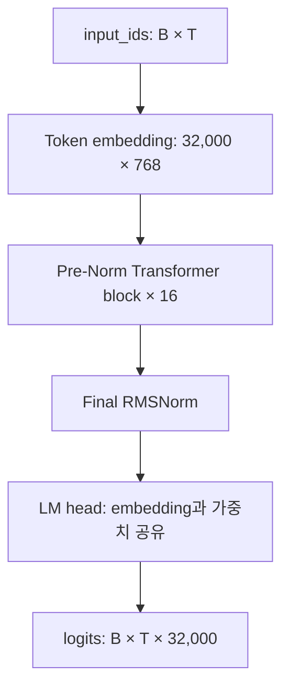
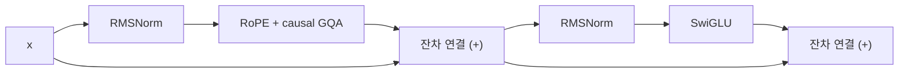
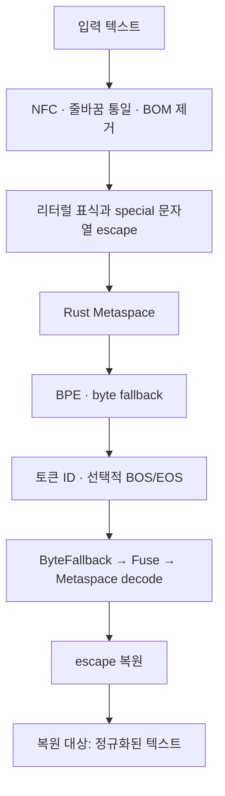
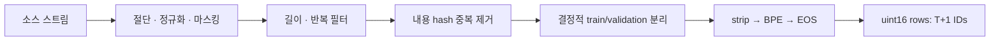
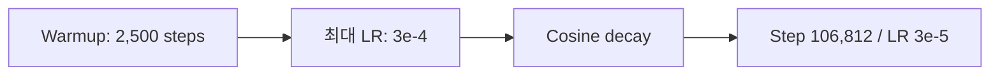
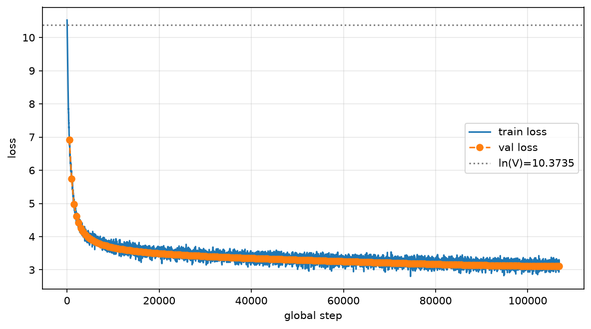
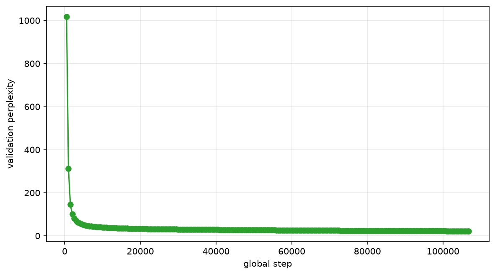
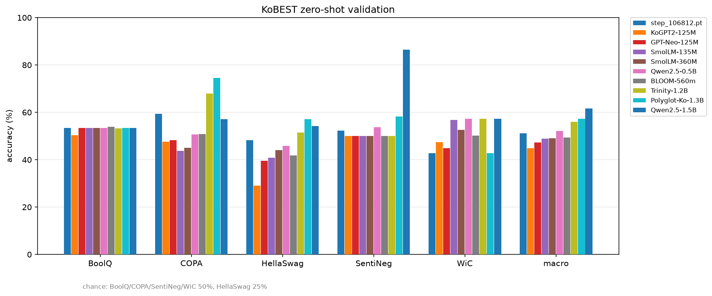
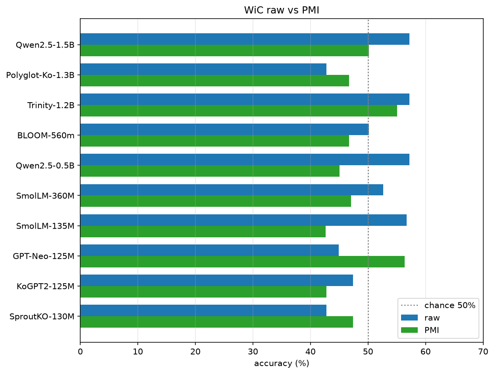

# SproutKO-130M 기술 백서

**한국어** · [English](WHITEPAPER.md) · [日本語](WHITEPAPER.ja.md)

## 한국어 중심 32K 토크나이저와 소형 언어 모델의 사전학습

**한국어 · 기술 검토본 v0.2 · 2026-09-09**

| 항목 | 내용 |
|---|---|
| 저자·소속 | 최종 출판본에서 확정 |
| 프로젝트 / 패키지 | SproutKO-130M / `sproutko` 0.1.0 |
| 모델 | 129,983,232개 고유 파라미터의 사전학습 기본 모델 |
| 토크나이저 | `sproutko-tokenizer-32k-v1`, release 1.0.0 |
| 학습 실행 | `sproutko_130m_24gb/20260903T033724Z` |
| 최종 체크포인트 | `step_106812.pt` |
| 실행 처리량 | 7,000,031,232 next-token targets |
| 문서 범위 | 구현, 보관된 학습·평가 기록, 로컬 export 및 재현성 |

이 백서는 SproutKO-130M의 모델 구조, 토크나이저, 데이터 처리, 사전학습, 한국어 평가를 기술한다. 수치는 보관된 실행 결과와 파일 검산에 근거한다. 코드·실험 근거 S1–S15는 [부록 D](#appendix-d)에, 원 논문과 데이터셋 출처는 [참고문헌](#references)에 연결한다.

## 목차

1. [초록](#abstract)
2. [서론](#introduction)
3. [관련 연구](#related-work)
4. [모델](#model)
5. [토크나이저](#tokenizer)
6. [데이터](#data)
7. [사전학습](#training)
8. [연산 자원](#compute)
9. [언어 모델 결과](#lm-results)
10. [한국어 평가](#evaluation)
11. [생성과 사용](#generation)
12. [한계와 이용 조건](#limitations)
13. [재현성](#reproducibility)
14. [결론](#conclusion)
15. [참고문헌](#references)
16. [부록](#appendix-a)

---

<a id="abstract"></a>
## 1. 초록

SproutKO-130M은 한국어 중심 텍스트의 다음 토큰 예측을 위해 처음부터 사전학습한 **129,983,232개 고유 파라미터**의 decoder-only Transformer다. 32,000개 어휘의 전용 BPE 토크나이저를 사용하며, 16개 Pre-Norm 블록에 RMSNorm, RoPE, grouped-query attention(GQA), SwiGLU를 적용했다. 입력 embedding과 출력 LM head는 가중치를 공유한다.

보관된 production 실행은 단일 NVIDIA RTX PRO 4500 Blackwell에서 길이 2,048, micro-batch 2, gradient accumulation 16, BF16 설정으로 106,812 optimizer step을 수행했다. 처리한 next-token target은 **7,000,031,232개**, 고유 파라미터당 약 **53.85개**다. 기록된 실행 시간은 **34.48시간**이며, 마지막으로 기록된 학습 손실은 3.1664다. 제한된 validation 배치의 최종 cross-entropy와 perplexity는 각각 **3.1094**, **22.4076**이다. [S1–S3, S13]

KoBEST validation의 로컬 zero-shot 평가에서 다섯 과제 정확도의 단순평균은 **51.21%**였다. COPA 59.40%, HellaSwag 48.20%를 기록했지만, 별도 진단에서는 BoolQ와 WiC의 예측이 한쪽 답변에 집중됐다. 두 과제에 도메인 조건 PMI 보정을 적용한 연구용 혼합 평균은 **52.02%**다. 이는 동일 가중치에 PMI 채점 보정을 적용한 결과다. [S7, S8]

본 백서는 한국어 전용 토크나이저와 소형 기본 모델을 구성한 구현 및 실험 기록을 제공한다. 후속 연구에서는 토크나이저 비교, 4,096 토큰 장문 평가, 설계 요소별 성능 분석을 다룬다.

<a id="introduction"></a>
## 2. 서론

이 프로젝트는 한국어 텍스트를 위한 전용 어휘와 토큰화 정책을 구성하고, 이를 약 130M 규모의 언어 모델에 적용하는 데서 출발한다. 한글 완성형과 자모, 띄어쓰기, 한영 혼합, 숫자·기호를 어떤 단위로 표현할지 정하고 그 결과를 학습 가능한 단일 토큰 ID 체계로 연결하는 것이 주요 설계 과제다.

전용 토크나이저는 Hugging Face의 Rust `tokenizers` 백엔드에 프로젝트용 어휘·병합 규칙과 정규화·공백·특수 문자열·byte fallback 정책을 적용한 구성이다. 학습 산출물을 동결하고 모델 설정과 체크포인트가 같은 tokenizer fingerprint를 사용하도록 관리한다. [S5, S6]

백서는 실제 모델과 동결 토크나이저의 구조, 완료된 한 차례의 7B-token 사전학습, 한국어 평가 결과와 답변 선택 편향을 다룬다. 모델의 설계 목적을 설명하고 관측된 성능을 과제별로 분석한다.

모델은 다음 토큰 예측으로 학습한 **사전학습 기본 모델**이다. 연구, 구조 분석, 추가 사전학습 및 미세조정의 출발점이 대상 용도다. [S11]

<a id="related-work"></a>
## 3. 관련 연구

모델의 기본 연산은 self-attention과 position-wise feed-forward 층으로 구성되는 Transformer에 기반한다. 본 구현은 인과적 attention을 사용하는 decoder-only 구조다. [Vaswani et al., 2017](https://arxiv.org/abs/1706.03762)

GQA는 여러 query head가 더 적은 key/value head를 공유하는 구성이다. SproutKO는 query 12개와 KV 4개를 사용한다. 위치 정보는 RoPE로 Q·K에 반영하며, 정규화에는 RMSNorm, feed-forward에는 SwiGLU를 사용한다. [Ainslie et al., 2023](https://arxiv.org/abs/2305.13245), [Su et al., 2021](https://arxiv.org/abs/2104.09864), [Zhang and Sennrich, 2019](https://arxiv.org/abs/1910.07467), [Shazeer, 2020](https://arxiv.org/abs/2002.05202)

토크나이저의 subword 학습은 BPE 계열이다. 희귀 단어를 부분 단위로 표현하는 subword 접근은 Sennrich et al.의 연구와 연결된다. SproutKO의 기여 범위는 한국어 중심 표본에서 학습한 32K 어휘와 처리·동결 정책이다. [Sennrich et al., 2016](https://aclanthology.org/P16-1162/)

한국어 평가는 다섯 한국어 과제로 구성된 KoBEST를 사용한다. 본문의 결과는 이 저장소의 validation·zero-shot·정확도 프로토콜로 계산한 값이다. [Jang et al., 2022](https://aclanthology.org/2022.coling-1.325/)

<a id="model"></a>
## 4. 모델

### 4.1 구성

| 항목 | 값 |
|---|---:|
| 고유 파라미터 수 | 129,983,232 |
| 어휘 수 / hidden size | 32,000 / 768 |
| Transformer 블록 수 | 16 |
| Query / KV heads | 12 / 4 |
| Head dimension / query heads per KV head | 64 / 3 |
| SwiGLU intermediate size | 2,176 |
| 정규화 | RMSNorm, epsilon 1e-6 |
| 위치 표현 | RoPE, theta 10,000 |
| Attention / MLP projection bias | 없음 |
| 입력·출력 embedding 공유 | 사용 |
| 사전학습 길이 / 구성상 문맥 길이 | 2,048 / 4,096 |

파라미터 수는 tied embedding을 한 번만 계수한다. 모델 설정과 projection 차원으로 계산한 합계는 129,983,232개다. 로컬 safetensors header의 shape를 합산하고 중복 저장된 LM head를 제외해도 같은 수가 나온다. [S11, S13]



그림 1. 모델 전체 구조. B는 배치 크기, T는 입력 길이다. RoPE는 attention의 Q·K에 위치 정보를 반영한다.

### 4.2 Transformer 블록

각 블록은 아래 두 잔차 연산을 순서대로 수행한다. 정규화는 attention과 MLP 입력에 적용하고 잔차 경로는 그대로 더한다.

```text
h = x + Attention(RMSNorm(x))
y = h + SwiGLU(RMSNorm(h))
SwiGLU(z) = W_down [SiLU(W_gate z) ⊙ (W_up z)]
```



그림 2. Pre-Norm 블록. MLP의 gate·up·down과 attention의 Q·K·V·O projection은 모두 bias-free 선형 변환이다. [S11]

### 4.3 Attention과 KV cache

Q의 shape는 `B × 12 × T × 64`, K·V는 `B × 4 × T × 64`다. RoPE를 적용한 K와 값 텐서 V를 KV cache에 보관한다. query head당 K·V를 독립 보관하는 12-head MHA와 비교하면 이 구성의 캐시 원소 수는 같은 B·T·dtype에서 1/3이다. 이 비율은 동일한 배치·길이·dtype에서 캐시 텐서의 원소 수를 기준으로 계산했다.

현재 attention 구현에는 PyTorch scaled dot-product attention 경로와 명시적 attention 연산 경로가 있다. SDPA에서는 `dropout_p=0.0`을 사용하며, 가용 API·장치에 따라 GQA 지원 또는 KV head 확장 경로를 선택한다. [S11]

생성은 prompt 전체를 처리하는 prefill 뒤에 한 토큰씩 decode하는 방식이다. 새 Q·K의 위치는 cache의 과거 길이부터 이어지며 K는 RoPE를 한 번 적용한 상태로 저장된다. 설정의 4,096은 생성 길이 검사와 cache 용량에도 사용된다. 4,096 토큰에서의 품질은 후속 장문 평가 항목이다.

### 4.4 초기화와 정밀도

Linear·embedding은 표준편차 0.02의 정규분포로 초기화하고 RMSNorm weight는 1로 시작한다. attention 출력 projection과 MLP down projection은 `0.02 / sqrt(2 × 16)`으로 초기화한다. 현재 구현은 RMSNorm의 제곱평균과 RoPE 회전을 FP32로 계산하고 필요한 지점에서 입력 dtype으로 되돌린다. 학습은 FP32 가중치와 BF16 autocast를 사용하는 경로를 가진다. [S3, S11]

<a id="tokenizer"></a>
## 5. 토크나이저

### 5.1 실제 처리 경로

동결 v1은 `rust_bpe` 백엔드를 사용한다. NFC 정규화와 CRLF·CR의 LF 통일, BOM 제거를 수행한다. 리터럴 `▁`, escape 문자 U+F0000, 네 special token 문자열은 내부 표식과 구분되도록 escape한다. Rust Metaspace는 `▁`를 공백 표식으로 사용하며 `prepend_scheme="never"`로 설정되어 있다. [S5, S6]



그림 3. 실제 동결 토크나이저의 처리 경로. 모델은 이 경로에서 생성한 토큰 ID를 embedding 입력으로 사용한다.

복원 기준은 **정규화문과 decode 결과의 일치**다. 가령 CRLF가 LF로, 분해된 한글이 NFC 조합형으로 변환될 수 있다. BOS/EOS 추가는 encode 인자로 제어하며 문서 패킹에서는 EOS를 추가한다.

| Special token | ID | 역할 |
|---|---:|---|
| `<pad>` | 0 | Padding |
| `<s>` | 1 | BOS |
| `</s>` | 2 | EOS |
| `<unk>` | 3 | UNK |

### 5.2 어휘 구성과 학습 정책

| 상호 배타적인 어휘 분류 | 개수 |
|---|---:|
| Special token | 4 |
| Byte fallback token | 256 |
| 기본 alphabet | 8,000 |
| 학습된 subword | 23,740 |
| **합계** | **32,000** |

기존 정적 감사에서 기본 한글 완성형 음절은 2,023개로 집계된다. 설정의 `base_hangul_count` 값은 2,350이며, 동결 어휘의 음절 수는 위 정적 집계값을 따른다. 동결 파일의 control·placeholder token 수는 각각 0개다. [S5, S14]

전체 어휘 중 한글을 포함하는 토큰은 12,907개, 라틴 문자를 포함하는 토큰은 11,450개, 공백 표식이 있는 토큰은 14,860개다. 이 수치는 중복을 허용한 문자군별 포함 빈도다. 입력 압축 효율은 문자/토큰 지표로 평가한다. [S14]

현재 Rust 학습 코드는 `min_frequency=2`, `limit_alphabet=8000`, `max_token_length=32`를 사용한다. ASCII·호환 자모·공백 표식을 초기 alphabet에 넣고 어휘와 병합을 학습한다. 학습 표본 추출은 소스별 문자 예산과 문서 ID 해시를 이용한다. 토크나이저 학습 표본의 소스별 비율은 sampling manifest를 기준으로 관리한다. [S6]

### 5.3 동결과 품질 기록

토크나이저는 2026-09-02 20:18:02 UTC에 `IMMUTABLE_FINAL` 상태로 동결됐다. manifest는 `tokenizers` 0.23.1, train·validation sample hash, sampling manifest hash, quality report 경로를 기록한다. 아래 값은 **동결 manifest에 보관된 평가 요약**이다. 상세 표본과 quality report 확보는 후속 자료 보완 항목이다. [S5]

| 지표 | 기록값 | 의미와 범위 |
|---|---:|---|
| 문자/토큰 | 3.1423 | 코드상 입력 문자열 길이 합 / encode 길이 합 |
| Byte fallback token rate | 0.1308% | 출력 ID 중 byte token 비율 |
| 어휘 활용률 | 84.49% | 표본에서 사용한 usable ID 비율 |
| Roundtrip 실패 | 0 | 해당 표본의 정규화문 복원 실패 |
| UNK token count | 0 | 해당 평가에서 관측된 UNK |
| Unreachable token count | 0 | 현재 audit 정의의 구조적 검사 |
| 내부 quality gate | GO | 프로젝트의 동결 기준 통과 |

`corpus_characters=119,553,175`는 현재 freeze 코드에서 학습 선택 문자 수에 연결되는 필드다. 어휘 활용률 분모는 네 special token과 placeholder를 제외하며 v1에서는 31,996이다. byte token은 분모에 포함된다.

현재 unreachable 검사는 special token, byte token, placeholder, 병합 결과, 단일 문자 base alphabet을 분류한 뒤 나머지 어휘 항목을 unreachable로 센다. roundtrip 실패 수는 평가에 사용한 표본을 기준으로 집계한다. 새 표본에서 측정할 때는 기존 manifest와 별도 날짜의 결과로 관리해야 한다. [S6, S14]

### 5.4 기록된 토큰화 사례

별도 추론 번들의 기존 CPU 동일성 기록에는 다음 사례가 있다. 보관된 `parity.json`에서 가져온 사례다. [S9]

| 입력 | 본문 토큰 ID | 복원 |
|---|---|---|
| `한국어는` | `[11423, 12925]` | `한국어는` |
| `안녕하세요. 오늘 날씨가 좋습니다!` | `[26928, 15009, 10444, 9661, 17359, 9045, 27692]` | 입력과 동일 |

32K embedding은 24,576,000개 파라미터로 전체의 약 18.91%다. 어휘 크기는 embedding의 파라미터 비용에 직접 연결된다. 후속 연구에서는 16K·32K·48K의 비용과 성능을 비교한다.

<a id="data"></a>
## 6. 데이터

### 6.1 소스 정의와 목표 배정

| 영역 | 코드에 정의된 소스·필드 | Ticket 배정 |
|---|---|---:|
| 한국어 | FineWeb-2 `kor_Hang/text` → FineWiki `ko/text` → 문법 seed | 190 / 200 = 95% |
| 영어 | FineWeb `text` | 5 / 200 = 2.5% |
| 코드 | `jtatman/python-code-dataset-500k`, `output` | 3 / 200 = 1.5% |
| 수학 | FineMath `finemath-4plus/text` | 2 / 200 = 1% |

이는 **소스 스트림의 설계 배정**이다. 문서 길이, 필터 통과율, 소스 소진, 패킹 중단 위치에 따라 실제 학습 토큰 비중은 달라진다. 한국어 스트림은 세 소스를 순차 연결하므로 FineWiki와 seed가 최종 패킹에 도달했는지도 메타데이터로 확인해야 한다. 소스별 실현 비중은 최종 패킹 메타데이터의 추가 집계 항목이다. [S4]

FineWeb-2는 다국어 웹 코퍼스이고 FineWiki는 Wikipedia 기반 데이터다. 원천 카드의 설명은 각 소스의 성격을 보여 준다. 학습 당시 revision은 실행 provenance의 보완 항목이다. [FineWeb-2 카드](https://huggingface.co/datasets/HuggingFaceFW/fineweb-2), [FineWiki 카드](https://huggingface.co/datasets/HuggingFaceFW/finewiki)

코드 데이터 경로는 `output` 필드의 텍스트를 읽어 사전학습 스트림에 넣는다. [S4]

### 6.2 전처리·중복 제거·분리

현재 corpus 구현은 긴 문서를 최대 50,000자로 절단하고 정규화와 일부 민감 패턴 마스킹을 수행한다. 길이와 반복 문자 비율 등을 확인하며 이메일·전화번호·주민등록번호 형식·계좌 형식·일부 API key 패턴·Slack 토큰·Kakao API 토큰을 placeholder로 치환한다. 이 과정은 정규식 패턴을 이용한 텍스트 마스킹이다.

중복 제거는 처리 후 텍스트의 SHA-256 기준이다. 내용 hash의 앞 8개 16진수 자리를 정수로 바꿔 validation 임계값과 비교해 split을 정한다. 혼합 정의의 validation 비율은 0.015다. 이 방식은 동일 처리 텍스트의 exact duplicate를 관리한다. 유사 문서와 평가 문항의 중복 분석은 후속 데이터 감사 항목이다. [S4]



그림 4. 현행 처리 파이프라인. 그림은 검토 시점의 HEAD를 기준으로 하며 학습 기록 SHA 이후 추가된 token-budget top-up 기능을 포함한다. 실행 당시 흐름의 복원에는 당시 코드 diff와 최종 manifest가 필요하다.

### 6.3 패킹과 처리량

32K 토큰 ID는 uint16에 저장한다. 각 row는 T+1개 ID를 가지고 앞 T개가 입력, 뒤 T개가 next-token label이다. 인접 row는 한 ID를 겹쳐 예측 target을 이어 간다. CE 함수는 이 입력·label 대응을 그대로 사용한다. [S4, S3]

문서 인코딩에는 `add_bos=False`, `add_eos=True`를 사용한다. tokenizer API와 별도로 패킹 단계는 입력에 `strip()`을 적용한다. EOS는 문서 경계를 표시한다. 같은 row의 뒤 문서는 앞 문서를 causal attention으로 참조할 수 있다.

| 기록된 집계 | Train | Validation |
|---|---:|---:|
| `total_documents` | 9,714,224 | 149,369 |
| Packed sequences | 3,417,984 | 52,051 |
| Next-token targets | 7,000,031,232 | 106,600,448 |
| Sequence length | 2,048 | 2,048 |

이 값은 `data_stats.json`의 집계다. `total_documents`의 집계 단위는 패킹 입력 항목이다. 현행 text-shard reader는 내용이 있는 줄을 항목으로 읽고 binary writer는 인코딩한 항목을 센다. 원문 경계와 대응하려면 원래 sidecar 메타데이터가 필요하다. [S2, S4]

Train의 packed sequence 수는 `106,812 × 2 × 16`과 일치한다. 현재 trainer는 epoch마다 `seed + epoch`로 shuffle한다. 이 크기는 한 packed epoch의 배치 수와 일치한다.

<a id="training"></a>
## 7. 사전학습

### 7.1 목적함수와 optimizer

학습은 다음 토큰의 평균 negative log-likelihood를 최소화한다. loss는 logits를 FP32로 변환하고 `ignore_index=-100`을 적용한다. gradient accumulation에서는 micro-batch 평균 loss에 유효 target 수를 곱해 backward한 뒤 누적 유효 target 수로 gradient를 나눈다. 따라서 유효 길이가 다른 배치도 토큰 수 기준으로 가중된다. [S3]

AdamW는 가중치 감쇠를 adaptive gradient update와 분리한다. 본 구현은 norm·bias 등 1차원 계열을 감쇠 대상에서 제외하고 tied parameter를 한 번 등록한다. 행렬 파라미터는 129,957,888개, RMSNorm 파라미터는 25,344개다. [Loshchilov and Hutter](https://arxiv.org/abs/1711.05101), [S3, S11]

### 7.2 실행 설정

| 설정 | 기록값 |
|---|---:|
| Seed | 42 |
| Sequence length | 2,048 |
| Micro-batch / gradient accumulation | 2 / 16 |
| Targets per optimizer step | 65,536 |
| Max steps | 106,812 |
| Optimizer | AdamW |
| Learning rate / minimum | 3e-4 / 3e-5 |
| Warmup / 후속 schedule | 2,500 step / cosine decay |
| Betas / epsilon | (0.9, 0.95) / 1e-8 |
| Weight decay | 0.1 |
| Gradient clipping norm | 1.0 |
| Precision | BF16 |
| Train log interval | 10 step 및 첫 step |
| Validation interval | 500 step 및 종료 step |
| Validation max batches | 256 |
| Checkpoint interval | 500 step 및 종료 step |
| Keep last checkpoints | 8 |

표는 `config.snapshot.json`에 명시된 항목이다. 현재 `TrainingConfig`의 기본값은 `torch_compile=false`, `gradient_checkpointing=false`이며 당시 실행값은 추가 확인 항목이다. [S3]



그림 5. 학습률 schedule 개요. 초기화와 `scheduler.step()` 시점에 따른 실제 update LR와 기록 시점 LR 차이가 있으므로 정확한 값은 로그·구현을 기준으로 한다.

### 7.3 체크포인트와 복구

체크포인트는 모델·optimizer·scheduler 상태, RNG, step, 처리량, tokenizer fingerprint, 데이터 진행 상태 등을 저장한다. 현재 구현은 임시 파일과 atomic replace를 사용하고 복구 시 tokenizer와 packed dataset fingerprint를 확인한다. resume 테스트는 상태 복구의 제한된 사례를 다룬다. [S3]

실제 실행은 dirty working tree로 기록됐다. 당시 실행을 복원하려면 기록된 SHA와 미커밋 변경사항, 데이터 및 환경을 함께 확보해야 한다. 본문의 학습 결과는 한 차례의 production 실행에 해당한다.

<a id="compute"></a>
## 8. 연산 자원

| 항목 | 보관 기록 |
|---|---|
| GPU | NVIDIA RTX PRO 4500 Blackwell, 1개 |
| 보고된 VRAM | 약 31.37 GiB, 원 필드명 `total_vram_gb` |
| 운영체제 / Python | Linux / 3.13.8 |
| PyTorch | 2.14.0+cu130 |
| CUDA runtime / driver | 13.0 / 580.126.20 |
| 실행 시간 | 124,110.48초 = 34.4751시간 |
| 처리량 / 기록 시간 | 56,401.61 target/s |
| 최대 로그 시점 allocated | 1,827.25 MiB |
| 최대 로그 시점 reserved | 7,392.00 MiB |

환경 문자열은 당시 `environment.json`의 기록이다. 시간과 평균 처리량은 `final_summary.json`으로 재계산했다. [S1, S13]

현재 trainer에서 elapsed는 training loop 시작부터 끝까지를 재므로 정기 validation과 checkpoint 저장이 포함된다. 데이터 수집·토크나이저 학습·패킹은 사전 준비 구간이다. 평균 처리량은 평가와 저장을 포함한 training loop의 elapsed 기준이다. resume 실행이라면 누적 target과 이번 실행 시간의 대응을 별도 확인해야 한다. [S3]

메모리 기록은 `memory_allocated()`와 `memory_reserved()`를 train log 시점에 읽은 값이다. 이 수치는 로그 시점의 allocator 상태를 나타낸다. 실제 peak allocation과 최소 필요 VRAM은 후속 계측 항목이다. 사용 GPU의 용량은 위 환경 기록을 따른다.

<a id="lm-results"></a>
## 9. 언어 모델 결과

### 9.1 학습 곡선

| 지표 | 값 | 관측 step |
|---|---:|---:|
| 최초 train loss | 10.5257 | 1 |
| 마지막 기록 train loss | 3.1664 | 106,810 |
| 최저·최종 val CE | 3.1094 | 106,812 |
| 최저·최종 val PPL | 22.4076 | 106,812 |
| 최종 처리 targets | 7,000,031,232 | 106,812 |

균등한 32,000개 어휘 분포의 CE는 `ln(32,000) ≈ 10.3735`다. 첫 학습 loss는 이 기준에 가까운 10.5257에서 시작한다. 마지막 train loss의 기록 시점은 종료보다 두 step 이른 106,810이다. train record는 10,682개, validation record는 214개다. [S2, S13]



그림 6. 보관된 train·validation loss 곡선. 서로 다른 입력 데이터와 집계 조건의 관측값이다.



그림 7. 최대 256배치의 validation에서 기록한 perplexity.

### 9.2 Validation의 범위

현재 `evaluate()`는 validation을 shuffle 없이 읽고 최대 256배치에서 중단한다. micro-batch 2와 길이 2,048을 적용하면 최대 **1,048,576개 target**이다. 전체 저장 validation은 106,600,448개다. 1,048,576은 설정으로 계산한 평가량 상한이며 실제 유효 target 수는 추가 확인 항목이다. [S2, S3]

PPL은 평균 CE에 지수함수를 적용한다. CE·PPL 기록은 각각 반올림되므로 `exp(3.1094)`를 다시 계산한 값과 저장 PPL의 마지막 자리가 조금 다를 수 있다. 본문은 로그의 22.4076을 사용한다.

loss 감소는 해당 next-token 목적함수의 개선을 보여 준다. 후속 평가에서는 최종 가중치의 full-validation과 체크포인트별 downstream 성능을 측정한다.

<a id="evaluation"></a>
## 10. 한국어 평가

### 10.1 데이터와 채점 프로토콜

기존 raw 평가는 `skt/kobest_v1` validation에서 zero-shot으로 수행됐다. 모델마다 native tokenizer를 사용하고 문맥 뒤 선택지의 토큰 평균 log-likelihood가 가장 큰 선택지를 고른다. 이 문서의 **raw는 토큰 평균 LL에 기반한 PMI 보정 전 채점**을 뜻한다. [S7]

| 과제 | 선택 방식 | 문항 수 | 균등 무작위 기준 |
|---|---|---:|---:|
| BoolQ | `아니오` / `예` | 700 | 50% |
| COPA | 원인·결과 대안 2개 | 500 | 50% |
| HellaSwag | 후속 문장 4개 | 500 | 25% |
| SentiNeg | `부정` / `긍정` | 400 | 50% |
| WiC | `다르다` / `같다` | 610 | 50% |

`encode_pair()`는 문맥+선택지를 인코딩한 뒤 문맥만 인코딩한 결과와의 최장 공통 prefix를 찾는다. 선택지 결합으로 BPE 경계의 마지막 문맥 토큰이 달라지면 그 지점부터 채점한다. 안정적인 prefix가 없을 때 BOS로 다시 시도한다. 길이가 넘으면 문맥 왼쪽을 잘라 선택지를 보존하고 선택지 자체가 너무 길면 실패 처리한다. 동점은 앞 index를 선택한다. [S7]

```text
score(choice | context) = mean(log p(scored token | preceding tokens))
prediction = argmax_choice score(choice | context)
macro accuracy = (BoolQ + COPA + HellaSwag + SentiNeg + WiC) / 5
```

SproutKO 원본 결과의 skipped는 모든 과제에서 0이다. 비교 모델들의 원본과 집계표도 이번에 대조했다. 평가 코드는 CUDA BF16 지원 여부에 따라 autocast를 선택한다. 비교는 공통 채점 코드를 기준으로 하며 과거 GPU·dtype·라이브러리·dataset revision은 provenance 보완 항목이다.

### 10.2 SproutKO 결과

| 과제 | 정답 / 문항 | 정확도 |
|---|---:|---:|
| BoolQ | 374 / 700 | 53.43% |
| COPA | 297 / 500 | 59.40% |
| HellaSwag | 241 / 500 | 48.20% |
| SentiNeg | 209 / 400 | 52.25% |
| WiC | 261 / 610 | 42.79% |
| **Macro** | 5개 과제 단순평균 | **51.21%** |

Macro는 과제마다 같은 가중치를 부여한다. 과제별 성능은 HellaSwag 25%, 나머지 과제 50%의 균등 무작위 기준과 함께 해석한다.

### 10.3 같은 로컬 프로토콜의 비교 모델

아래 값은 저장소에 보관된 평가 기록이다. 모델 이름과 규모 표기는 각 model ID를 따른다. SmolLM 비교군은 **SmolLM-135M과 SmolLM-360M**이다. [S7, S13]

| 모델 | BoolQ | COPA | HellaSwag | SentiNeg | WiC | Macro |
|---|---:|---:|---:|---:|---:|---:|
| **SproutKO-130M** | 53.43 | 59.40 | 48.20 | 52.25 | 42.79 | **51.21** |
| KoGPT2-base-v2 | 50.29 | 47.60 | 29.00 | 50.00 | 47.38 | 44.85 |
| GPT-Neo-125M | 53.43 | 48.20 | 39.60 | 50.00 | 44.92 | 47.23 |
| SmolLM-135M | 53.43 | 43.80 | 40.80 | 50.00 | 56.72 | 48.95 |
| SmolLM-360M | 53.43 | 45.00 | 44.00 | 50.00 | 52.62 | 49.01 |
| Qwen2.5-0.5B | 53.43 | 50.60 | 45.80 | 53.75 | 57.21 | 52.16 |
| BLOOM-560m | 53.86 | 50.80 | 41.80 | 50.00 | 50.16 | 49.32 |
| Ko-GPT-Trinity-1.2B | 53.29 | 68.00 | 51.40 | 50.00 | 57.21 | 55.98 |
| Polyglot-Ko-1.3B | 53.43 | 74.60 | 57.20 | 58.25 | 42.79 | 57.25 |
| Qwen2.5-1.5B | 53.43 | 57.20 | 54.20 | 86.50 | 57.21 | 61.71 |

단위는 %. 정확한 ID는 부록 C에 제시한다. 각 모델은 고유한 어휘·학습량·데이터·문맥 길이 조건을 가진다.



그림 8. 보관된 로컬 zero-shot 비교 그림. 범례의 `step_106812.pt`는 SproutKO-130M이다. HellaSwag의 균등 무작위 기준은 25%, 나머지는 50%다. Macro는 다섯 과제의 단순평균이며, 모델별 정확한 값과 식별자는 위 표와 부록 C를 따른다.

SproutKO raw macro는 KoGPT2보다 약 6.36%p, SmolLM-135M보다 약 2.26%p 높고 Qwen2.5-0.5B보다 약 0.95%p 낮다. 이는 해당 프로토콜의 관측값이다. COPA·HellaSwag와 BoolQ·WiC는 서로 다른 양상을 보여 평균만으로 한국어 능력을 요약하기 어렵다.

### 10.4 한쪽 답변 선택과 PMI 분석

별도 PMI 진단 집계에서 SproutKO는 BoolQ 700개 모두 `아니오`, WiC 610개 모두 `같다`를 raw로 선택했다. BoolQ 정답의 `아니오` 비중은 374/700 = 53.43%이고 WiC 정답의 `같다` 비중은 261/610 = 42.79%다. 이 두 raw 정확도는 모든 문항에서 같은 답을 고르는 상수 선택의 정확도와 같다. [S8]

도메인 조건 PMI는 문항 점수에서 공통 prefix 아래 선택지 점수를 뺀다. BoolQ는 `답:`, WiC는 `이 단어의 의미는 두 문장에서 `를 prefix로 사용한다. 평균 토큰 LL 차이를 프로젝트에서는 PMI라 부른다.

```text
PMI score = mean_logp(choice | item context)
          - mean_logp(choice | domain prefix)
```

| 과제 | Raw 정확도 | PMI 정확도 | Raw 예측 분포 | PMI 예측 분포 |
|---|---:|---:|---|---|
| BoolQ | 53.43% | 52.86% | 아니오 700 / 예 0 | 아니오 634 / 예 66 |
| WiC | 42.79% | 47.38% | 다르다 0 / 같다 610 | 다르다 240 / 같다 370 |

PMI는 WiC의 상수 선택을 깨뜨리지만 47.38%는 균등 무작위 50%와 다수 클래스 기준 349/610 = 57.21%보다 낮다. BoolQ의 보정 결과도 다수 클래스 기준 53.43%보다 낮다. 이 선택 분포 변화는 답변 prior에 대한 민감성을 보여 준다.

| 채점 조합 | BoolQ | COPA | HellaSwag | SentiNeg | WiC | Macro |
|---|---:|---:|---:|---:|---:|---:|
| Raw | 53.43 | 59.40 | 48.20 | 52.25 | 42.79 | 51.21 |
| BoolQ·WiC만 PMI | 52.86 | 59.40 | 48.20 | 52.25 | 47.38 | 52.02 |

혼합 점수 상승은 반올림 전 약 **0.8037%p**다. 표시된 두 자리 수만 빼면 0.81%p가 되므로 정밀한 차이는 원시 집계로 계산한다. raw와 혼합은 별도 프로토콜로 유지한다. 차이의 통계적 유의성은 문항별 예측을 확보한 뒤 paired 분석으로 검토할 항목이다. [S13]

PMI 집계의 일부 한글 문자열 필드에는 replacement character가 남아 있다. 위 label 이름은 숫자 ID와 평가 코드의 verbalizer 대응을 기준으로 해석했다. [S7, S8, S13]



그림 9. 보관된 WiC raw·PMI 비교. 점선은 균등 무작위 기준인 50%를 나타낸다. 해당 validation의 다수 클래스 기준은 57.21%다. 보정의 방향과 크기는 모델마다 다르게 나타난다.

<a id="generation"></a>
## 11. 생성과 사용

### 11.1 기본 모델 사용

`SproutKOForCausalLM.from_pretrained()`와 `SproutKOTokenizer.from_pretrained()`는 로컬 export 또는 Hub 파일을 읽는 자체 API다. 다음 코드는 프로젝트 API를 이용한 로컬 번들 사용 예시다. [S11]

```python
import torch
from sproutko.model import SproutKOForCausalLM
from sproutko.tokenizer.tokenizer import SproutKOTokenizer
from sproutko.generation import generate

bundle = "."  # config.json, model.safetensors, tokenizer JSON이 있는 경로
model = SproutKOForCausalLM.from_pretrained(bundle).eval()
tokenizer = SproutKOTokenizer.from_pretrained(bundle)
ids = tokenizer.encode("한국어는", add_bos=False, add_eos=False)
output = generate(
    model, torch.tensor([ids], dtype=torch.long),
    max_new_tokens=64, temperature=0.0,
    eos_token_id=tokenizer.eos_token_id,
)
print(tokenizer.decode(output[0].tolist(), skip_special_tokens=True))
```

생성기는 greedy, temperature, top-k, top-p와 EOS 종료를 지원한다. `prompt length + max_new_tokens`가 구성 길이를 넘으면 오류로 처리한다. 챗 템플릿과 시스템 메시지에 따른 지시 준수는 후속 평가 항목이다.

### 11.2 로컬 export와 동일성

로컬 safetensors에는 FP32 텐서 147개, 저장 원소 154,559,232개가 있다. embedding과 LM head가 별도 이름으로 중복 저장되어 실제 고유 파라미터보다 크다. 두 저장 텐서의 byte SHA-256은 일치하며 중복된 24,576,000개 원소를 제외하면 129,983,232개다. 이번 검사는 파일 구조와 저장된 텐서 bytes를 대상으로 수행했다. [S13]

별도 추론 번들의 기존 검증 기록은 tokenizer 9개 사례, 실제 130M 모델 CPU logits와 12-token greedy 출력 동일성, 31개 테스트 통과, wheel 설치 후 CLI 실행을 보고한다. GPU 추론과 실시간 Hub 다운로드 검증은 후속 배포 점검 항목이다. [S9]

후속 생성 평가에서는 대표 prompt 집합과 샘플링 조건을 고정하고 성공·실패 사례를 함께 보관한다.

<a id="limitations"></a>
## 12. 한계와 이용 조건

### 12.1 평가·데이터의 한계

데이터 provenance 보완 항목은 최종 원천 revision, 소스별 실제 토큰 기여량, 필터링 전후 집계다. 데이터 감사에서는 near-duplicate와 benchmark contamination을 분석한다.

토크나이저 지표의 평가 범위는 동결 당시 표본이다. 외부 고정 표본의 tokenizer 비교와 어휘 크기·alphabet 정책 ablation을 통해 한국어 효율과 LM 성능에 대한 기여를 평가할 수 있다.

LM validation은 일부 배치에 제한되고 KoBEST는 하나의 validation 프로토콜이다. native tokenizer와 문맥 제한, 불완전한 provenance가 비교의 한계다. BoolQ·WiC의 상수 선택을 고려하면 문맥 이해 분석에는 정확도와 함께 예측 분포와 문항별 반응을 살펴볼 필요가 있다.

학습 길이는 2,048이다. 후속 성능 평가 범위는 4K 장문 이해와 영어·코드·수학 과제다. 사실성·안전성·편향 완화·지시 준수도 별도 평가가 필요하다.

### 12.2 코드·모델·데이터 조건

학습 저장소의 `LICENSE`와 패키지 metadata는 **All Rights Reserved**다. 별도 추론 저장소의 `LICENSE`는 **Apache-2.0**이다. 이용 조건은 각 저장소·배포 번들·원천 데이터의 라이선스를 따른다. 로컬 export 식별자는 부록 B에 제시한다. 온라인 공개 상태와 최종 배포 조건은 릴리스 시점에 확정한다. [S10]

아래는 2026-09-09에 확인한 원천 카드의 표기다. 학습에 사용한 revision과 범위는 실행 provenance에서 관리한다.

| 소스 | 현재 카드의 조건 표기 |
|---|---|
| FineWeb-2 | ODC-By 1.0, Common Crawl 이용 조건. [카드](https://huggingface.co/datasets/HuggingFaceFW/fineweb-2) |
| FineWiki | CC BY-SA 4.0 및 GFDL 표기. [카드](https://huggingface.co/datasets/HuggingFaceFW/finewiki) |
| FineWeb | ODC-By 1.0, Common Crawl 이용 조건. [카드](https://huggingface.co/datasets/HuggingFaceFW/fineweb) |
| Python code dataset | MIT 표기. [카드](https://huggingface.co/datasets/jtatman/python-code-dataset-500k) |
| FineMath | ODC-By 1.0, Common Crawl 이용 조건. [카드](https://huggingface.co/datasets/HuggingFaceTB/finemath) |
| KoBEST v1 | CC BY-SA 4.0 표기. [카드](https://huggingface.co/datasets/skt/kobest_v1) |

<a id="reproducibility"></a>
## 13. 재현성

### 13.1 증거와 버전

| 구분 | 식별·상태 |
|---|---|
| Production train | `7b4ae3fb6d8a9e74a8bd910c769ddcb00b17068c`, dirty |
| Raw KoBEST 10개 모델 | 원본 JSON에 위 SHA 기록 |
| PMI 분석 | 보고서에 `b3183e58b3171987f3ff7e4d292b9e08b69c3e26` 기록. PMI 채점은 `5f007b7f7211dff197d1c6cd5379c659bedf07f9`에 들어감 |
| 코드 검토 기준 HEAD | `550c8cb8bfec381cb7e97fba67e03a3364f10fe4` |
| 보관 파일 검산 | 학습 manifest의 14개 hash 일치 |
| 평가 집계 검산 | 10개 raw 원본·PMI·혼합 집계의 산술 일치 |
| 로컬 export 검사 | 파일 hash, tensor shape, tied tensor bytes 확인 |

학습 manifest에는 `--config configs/sproutko_130m_24gb.json`이 기록되어 있다. 현행 데이터·패킹·평가·export 일부는 이 SHA 이후 변경되었다. 과거 실험의 재현에는 당시 미커밋 diff와 데이터·환경 기록이 필요하다.

### 13.2 명령과 역할

다음은 저장소 루트에서 사용하는 진입점이다. 라이브러리와 해당 데이터·가중치가 필요하다. 이번 집필에서는 첫 번째 정적 근거 검산 명령만 실행했다.

```bash
# 저장된 수치·hash·로컬 가중치 구조 검사
python docs/whitepaper/build_evidence.py

# 기존 run report 검증
python scripts/verify_training_report.py --run-dir results/sproutko_130m_24gb/20260903T033724Z

# 동결 tokenizer 동작 검사
python scripts/audit_frozen_tokenizer.py --tokenizer sproutko-tokenizer-32k-v1.json --manifest sproutko-tokenizer-32k-v1.manifest.json

# 학습 manifest에 기록된 명령: 준비된 데이터와 당시 코드 필요
python scripts/train.py --config configs/sproutko_130m_24gb.json

# 현행 코드로 로컬 export 새 평가: 과거 결과와 구분
python scripts/eval_kobest.py --checkpoint . --split validation --device cuda

# 현행 코드로 고정 greedy 생성
python scripts/generate.py --checkpoint . --prompt "한국어는" --max-new-tokens 64 --temperature 0 --seed 42
```

`build_evidence.py`는 표준 라이브러리만 사용하며 [EVIDENCE_TABLES.json](EVIDENCE_TABLES.json)을 다시 만든다. hash, 정답/문항과 평균, PMI·혼합 집계, safetensors shape·tied bytes를 대조한다.

이번 집필의 검증 범위는 표준 라이브러리를 이용한 기록 산술, 파일 hash, 로컬 safetensors 구조 검사다. 모델·tokenizer 동작 검증에는 torch·tokenizers·pytest 환경이 필요하다. 원래 학습 데이터, tokenizer 상세 평가 표본, 원본 `.pt`, 문항별 예측은 후속 자료 복구 항목이다.

<a id="conclusion"></a>
## 14. 결론

SproutKO-130M은 전용 32K BPE 토크나이저와 129,983,232개 고유 파라미터의 decoder-only 모델을 연결한 한국어 중심 사전학습 프로젝트다. 단일 GPU에서 약 7B next-token target을 처리했으며 제한된 validation의 최종 PPL은 22.4076, KoBEST raw macro는 51.21%다.

결과는 과제별로 다르다. COPA와 HellaSwag의 관측 정확도는 해당 무작위 기준을 넘지만 BoolQ와 WiC에서는 상수 답변 선택이 드러났다. PMI는 일부 선택 분포를 바꾸었으나 동일 가중치의 채점법 보정으로 이해해야 한다.

이 문서는 구조·동결 artifact·학습 기록·평가 방법을 연결한다. 후속 검증은 데이터 provenance, 독립 tokenizer 비교, 전체 validation, 배포 번들의 문항별 재평가로 확장할 수 있다. 개별 설계 효과와 더 넓은 언어 능력에 대한 결론은 그 결과를 바탕으로 갱신해야 한다.

<a id="references"></a>
## 참고문헌

1. Vaswani, A., et al. (2017). *Attention Is All You Need*. [arXiv:1706.03762](https://arxiv.org/abs/1706.03762).
2. Ainslie, J., et al. (2023). *GQA: Training Generalized Multi-Query Transformer Models from Multi-Head Checkpoints*. [arXiv:2305.13245](https://arxiv.org/abs/2305.13245).
3. Su, J., et al. (2021). *RoFormer: Enhanced Transformer with Rotary Position Embedding*. [arXiv:2104.09864](https://arxiv.org/abs/2104.09864).
4. Zhang, B., and Sennrich, R. (2019). *Root Mean Square Layer Normalization*. [arXiv:1910.07467](https://arxiv.org/abs/1910.07467).
5. Shazeer, N. (2020). *GLU Variants Improve Transformer*. [arXiv:2002.05202](https://arxiv.org/abs/2002.05202).
6. Sennrich, R., Haddow, B., and Birch, A. (2016). *Neural Machine Translation of Rare Words with Subword Units*. ACL, 1715–1725. [ACL Anthology](https://aclanthology.org/P16-1162/).
7. Loshchilov, I., and Hutter, F. *Decoupled Weight Decay Regularization*. [arXiv:1711.05101](https://arxiv.org/abs/1711.05101).
8. Jang, M., Kim, D., Kwon, D. S., and Davis, E. (2022). *KoBEST: Korean Balanced Evaluation of Significant Tasks*. COLING, 3697–3708. [ACL Anthology](https://aclanthology.org/2022.coling-1.325/).
9. HuggingFaceFW. *FineWeb-2*. [데이터셋 카드](https://huggingface.co/datasets/HuggingFaceFW/fineweb-2).
10. HuggingFaceFW. *FineWiki*. [데이터셋 카드](https://huggingface.co/datasets/HuggingFaceFW/finewiki).
11. HuggingFaceFW. *FineWeb*. [데이터셋 카드](https://huggingface.co/datasets/HuggingFaceFW/fineweb).
12. jtatman. *python-code-dataset-500k*. [데이터셋 카드](https://huggingface.co/datasets/jtatman/python-code-dataset-500k).
13. HuggingFaceTB. *FineMath*. [데이터셋 카드](https://huggingface.co/datasets/HuggingFaceTB/finemath).
14. SK Telecom. *KoBEST v1*. [데이터셋 카드](https://huggingface.co/datasets/skt/kobest_v1).

데이터셋 카드는 2026-09-09에 확인했다. 학습 데이터 revision은 실행 식별 정보의 보완 항목이다.

---

<a id="appendix-a"></a>
## 부록 A. 파라미터와 tensor convention

| 구성 | 계산식 | 고유 파라미터 |
|---|---|---:|
| Tied embedding / LM head | 32,000 × 768 | 24,576,000 |
| Attention 16개 블록 | 16 × (2×768² + 2×768×256) | 25,165,824 |
| SwiGLU 16개 블록 | 16 × 3 × 768 × 2,176 | 80,216,064 |
| RMSNorm | (16×2 + 1) × 768 | 25,344 |
| **합계** | | **129,983,232** |

| 기호 | 의미 | 값 또는 shape |
|---|---|---|
| B / T | Micro-batch / sequence length | 학습 2 / 2,048 |
| C / D | Hidden / head dimension | 768 / 64 |
| Hq / Hkv | Query / KV head 수 | 12 / 4 |
| Vocab | Vocabulary size | 32,000 |
| Q | RoPE 적용 query | B × 12 × T × 64 |
| K, V | Cache에 보관할 key/value | B × 4 × T × 64 |
| Logits | Vocabulary scores | B × T × 32,000 |

위치 정보는 고정 역주파수 buffer를 이용한 RoPE로 계산한다.

<a id="appendix-b"></a>
## 부록 B. 로컬 export 식별자

| 파일 | SHA-256 |
|---|---|
| `model.safetensors` | `3824bc2c653c4302e5bb5b212c277c01f2893e5a8c54c2006f3734324b56a671` |
| `config.json` | `9d308b1573dd25064c2fe05af8c4e075f6ac74f3d450abd052c6d59dc32b5365` |
| `sproutko-tokenizer-32k-v1.json` | `6b731407617bb5c03290109bd1f807401ea78cd8e3e18bee9e2d7f37a6f44ad4` |

이번 집필에서 로컬 파일을 직접 읽어 계산했고 기존 배포 기록과 일치한다. config에는 `source_checkpoint=step_106812.pt`, `global_step=106812`, `instruction_tuned=false`가 기록된다. 검증 대상은 보관된 로컬 export 파일이다. [S11, S13]

<a id="appendix-c"></a>
## 부록 C. KoBEST 비교군과 prompt

| 본문 이름 | 원본 결과의 model ID |
|---|---|
| SproutKO-130M | `runs/sproutko_130m_24gb/20260903T033724Z/checkpoints/step_106812.pt` |
| KoGPT2-base-v2 | `skt/kogpt2-base-v2` |
| GPT-Neo-125M | `EleutherAI/gpt-neo-125M` |
| SmolLM-135M | `HuggingFaceTB/SmolLM-135M` |
| SmolLM-360M | `HuggingFaceTB/SmolLM-360M` |
| Qwen2.5-0.5B | `Qwen/Qwen2.5-0.5B` |
| BLOOM-560m | `bigscience/bloom-560m` |
| Ko-GPT-Trinity-1.2B | `skt/ko-gpt-trinity-1.2B-v0.5` |
| Polyglot-Ko-1.3B | `EleutherAI/polyglot-ko-1.3b` |
| Qwen2.5-1.5B | `Qwen/Qwen2.5-1.5B` |

아래 `\n`은 줄바꿈을, 마지막 공백은 실제 prompt의 공백을 나타낸다. 선택지는 context 뒤에 붙이며 joint tokenization을 수행한다.

```text
BoolQ:    {paragraph}\n\n질문: {question}\n답:
COPA 원인: {premise} 왜냐하면 
COPA 결과: {premise} 그래서 
HellaSwag: {context} 
SentiNeg: 문장: {sentence}\n감정:
WiC:      단어: {word}\n문장1: {context_1}\n문장2: {context_2}\n이 단어의 의미는 두 문장에서 
```

정확한 문자열과 `rstrip()`은 [평가 구현](../../sproutko/eval/kobest.py)의 `PROMPT_TEMPLATES`·`example_from_row()`를 따른다. 과거 raw JSON에도 template이 저장되어 있다.

<a id="appendix-d"></a>
## 부록 D. 구현·실험 근거

| ID | 근거 |
|---|---|
| S1 | [학습 보고서](../../results/sproutko_130m_24gb/20260903T033724Z/REPORT.md), [실행 manifest](../../results/sproutko_130m_24gb/20260903T033724Z/run_manifest.json), [환경](../../results/sproutko_130m_24gb/20260903T033724Z/environment.json) |
| S2 | [학습 로그](../../results/sproutko_130m_24gb/20260903T033724Z/training_log.jsonl), [최종 요약](../../results/sproutko_130m_24gb/20260903T033724Z/final_summary.json), [데이터 집계](../../results/sproutko_130m_24gb/20260903T033724Z/data_stats.json) |
| S3 | [학습 설정](../../results/sproutko_130m_24gb/20260903T033724Z/config.snapshot.json), [trainer](../../sproutko/training/trainer.py), [loss](../../sproutko/training/loss.py), [optimizer](../../sproutko/training/optimizer.py), [scheduler](../../sproutko/training/scheduler.py), [checkpoint](../../sproutko/training/checkpoint.py) |
| S4 | [혼합 정의](../../sproutko/corpus/pretraining_mix.py), [ingest](../../sproutko/corpus/ingest.py), [builder](../../sproutko/corpus/builder.py), [필터](../../sproutko/corpus/filters.py), [dedup](../../sproutko/corpus/dedup.py), [분리](../../sproutko/corpus/sharding.py), [binary packing](../../sproutko/training/token_storage.py), [text reader](../../sproutko/training/data.py) |
| S5 | [동결 manifest](../../sproutko-tokenizer-32k-v1.manifest.json) |
| S6 | [tokenizer API](../../sproutko/tokenizer/tokenizer.py), [Rust backend](../../sproutko/tokenizer/rust_backend.py), [정규화](../../sproutko/tokenizer/normalization.py), [sampling](../../sproutko/tokenizer/sampling.py), [audit](../../sproutko/tokenizer/audit.py), [validation](../../sproutko/tokenizer/validation.py), [analysis](../../sproutko/tokenizer/analysis.py), [freeze](../../scripts/freeze_final_tokenizer.py) |
| S7 | [SproutKO 원본 평가](../../results/kobest/20260904T142650Z/results.json), [raw 비교](../../results/kobest/compare.json), [평가 구현](../../sproutko/eval/kobest.py), [평가 CLI](../../scripts/eval_kobest.py) |
| S8 | [PMI 보고서](../../results/kobest_pmi/REPORT.md), [PMI 집계](../../results/kobest_pmi/compare.json), [혼합 보고서](../../results/kobest_composite/REPORT.md), [혼합 집계](../../results/kobest_composite/compare.json) |
| S9 | 별도 로컬 추론 저장소의 [검증 보고서](../../../SproutKO-Inference/release/VERIFICATION.md), [parity 기록](../../../SproutKO-Inference/release/parity.json), [체크섬](../../../SproutKO-Inference/release/SHA256SUMS) |
| S10 | [학습 저장소 LICENSE](../../LICENSE), [패키지 metadata](../../pyproject.toml), 별도 추론 저장소의 [LICENSE](../../../SproutKO-Inference/LICENSE) |
| S11 | [모델 설정](../../sproutko/config.py), [export config](../../config.json), [causal LM](../../sproutko/model/causal_lm.py), [backbone](../../sproutko/model/transformer.py), [attention](../../sproutko/model/attention.py), [생성](../../sproutko/generation/generate.py), [로더](../../sproutko/pretrained.py) |
| S12 | [기존 report 검증기](../../scripts/verify_training_report.py) |
| S13 | 이번 [근거 검산 JSON](EVIDENCE_TABLES.json), [검산 스크립트](build_evidence.py), [코드·기록 정적 감사](CODEBASE_AUDIT.20260909.json) |
| S14 | [토크나이저 정적 감사](TOKENIZER_STATIC_AUDIT.20260908.json), [지표·후속 실험 계획](TOKENIZER_PLAN.ko.md) |
| S15 | [전체 작성 계획](WRITING_PLAN.ko.md), [근거 상태](EVIDENCE.ko.md) |

이 목록은 로컬 기술 검토본용이다. 별도 저장소 자료와 비공개 자료는 출판 시 공개 가능한 첨부 또는 영속 식별자로 교체해야 한다. 이전 원고는 [v0.1 보관본](WHITEPAPER.v0.1.ko.md)에 남겼다.
