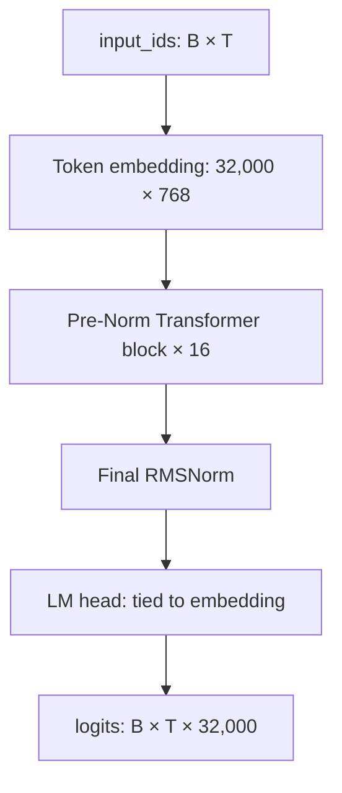
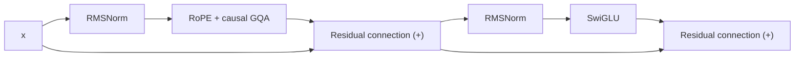
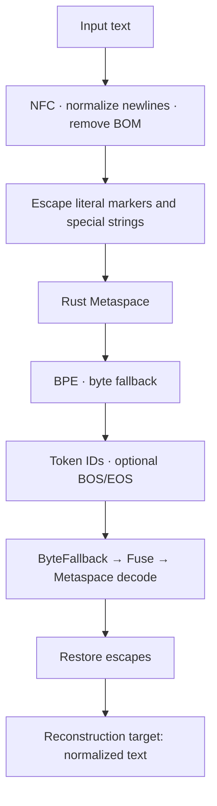
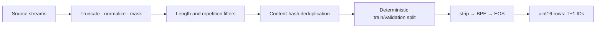
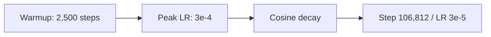

# SproutKO-130M Technical Whitepaper

[한국어](WHITEPAPER.ko.md) · **English** · [日本語](WHITEPAPER.ja.md)

## Pretraining a Small Language Model with a Korean-Focused 32K Tokenizer

**English · Technical review draft v0.2 · 2026-09-09**

| Item | Description |
|---|---|
| Authors and affiliations | To be finalized for publication |
| Project / package | SproutKO-130M / `sproutko` 0.1.0 |
| Model | Pretrained base model with 129,983,232 unique parameters |
| Tokenizer | `sproutko-tokenizer-32k-v1`, release 1.0.0 |
| Training run | `sproutko_130m_24gb/20260903T033724Z` |
| Final checkpoint | `step_106812.pt` |
| Training volume | 7,000,031,232 next-token targets |
| Scope | Implementation, archived training and evaluation records, local export, and reproducibility |

This whitepaper describes the architecture, tokenizer, data processing, pretraining, and Korean evaluation of SproutKO-130M. Numerical results are grounded in archived runs and file-level verification. Code and experimental evidence S1–S15 appear in [Appendix D](#appendix-d); original papers and dataset sources appear in the [References](#references).

## Contents

1. [Abstract](#abstract)
2. [Introduction](#introduction)
3. [Related Work](#related-work)
4. [Model](#model)
5. [Tokenizer](#tokenizer)
6. [Data](#data)
7. [Pretraining](#training)
8. [Compute Resources](#compute)
9. [Language-Model Results](#lm-results)
10. [Korean Evaluation](#evaluation)
11. [Generation and Usage](#generation)
12. [Limitations and Usage Terms](#limitations)
13. [Reproducibility](#reproducibility)
14. [Conclusion](#conclusion)
15. [References](#references)
16. [Appendices](#appendix-a)

---

<a id="abstract"></a>
## 1. Abstract

SproutKO-130M is a decoder-only Transformer with **129,983,232 unique parameters**, pretrained from scratch for next-token prediction on Korean-focused text. It uses a dedicated BPE tokenizer with a vocabulary of 32,000 and 16 Pre-Norm blocks incorporating RMSNorm, RoPE, grouped-query attention (GQA), and SwiGLU. The input embedding and output LM head share weights.

The archived production run completed 106,812 optimizer steps on a single NVIDIA RTX PRO 4500 Blackwell, using sequence length 2,048, micro-batch size 2, gradient accumulation 16, and BF16. It processed **7,000,031,232 next-token targets**, approximately **53.85 per unique parameter**. Recorded runtime was **34.48 hours**, and the last logged training loss was 3.1664. Final cross-entropy and perplexity on the limited validation batches were **3.1094** and **22.4076**, respectively. [S1–S3, S13]

Local zero-shot evaluation on KoBEST validation yielded a simple mean accuracy of **51.21%** across five tasks, including 59.40% on COPA and 48.20% on HellaSwag. A separate diagnostic showed concentrated answer selection on BoolQ and WiC. Applying domain-conditional PMI correction to these two tasks produced a research composite mean of **52.02%**, using the same model weights with adjusted scoring. [S7, S8]

This whitepaper provides implementation and experimental records for a dedicated Korean tokenizer and a small base model. Follow-up work covers tokenizer comparisons, evaluation at 4,096 tokens, and analysis of individual design choices.

<a id="introduction"></a>
## 2. Introduction

The project begins with a dedicated vocabulary and tokenization policy for Korean text, applied to a language model of approximately 130M parameters. A central design task is choosing units for Hangul syllables and jamo, spacing, mixed Korean and English, numbers, and symbols, then mapping them into a unified token ID system for learning.

The dedicated tokenizer combines Hugging Face's Rust `tokenizers` backend with project-specific vocabulary and merges, normalization, whitespace handling, special-string escaping, and byte fallback policies. The trained artifacts are frozen, and model configurations and checkpoints are managed against the same tokenizer fingerprint. [S5, S6]

The whitepaper covers the implemented model and frozen tokenizer, one completed 7B-token pretraining run, Korean evaluation results, and answer-selection bias. It explains the design objectives and analyzes observed performance by task.

The model is a **pretrained base model** trained through next-token prediction. Its intended uses include research, architectural analysis, continued pretraining, and a starting point for fine-tuning. [S11]

<a id="related-work"></a>
## 3. Related Work

The model is based on the Transformer, whose core operations combine self-attention with position-wise feed-forward layers. This implementation uses a decoder-only architecture with causal attention. [Vaswani et al., 2017](https://arxiv.org/abs/1706.03762)

GQA lets multiple query heads share a smaller set of key/value heads. SproutKO uses 12 query heads and 4 KV heads. RoPE encodes position in Q and K, RMSNorm provides normalization, and SwiGLU supplies the feed-forward transformation. [Ainslie et al., 2023](https://arxiv.org/abs/2305.13245), [Su et al., 2021](https://arxiv.org/abs/2104.09864), [Zhang and Sennrich, 2019](https://arxiv.org/abs/1910.07467), [Shazeer, 2020](https://arxiv.org/abs/2002.05202)

Subword training follows the BPE family. Representing rare words through subword units connects to the work of Sennrich et al. SproutKO's contribution comprises a 32K vocabulary trained on Korean-focused samples and the associated processing and freezing policies. [Sennrich et al., 2016](https://aclanthology.org/P16-1162/)

Korean evaluation uses KoBEST, which comprises five Korean tasks. Results in this whitepaper follow the repository's validation, zero-shot, and accuracy protocol. [Jang et al., 2022](https://aclanthology.org/2022.coling-1.325/)

<a id="model"></a>
## 4. Model

### 4.1 Configuration

| Item | Value |
|---|---:|
| Unique parameters | 129,983,232 |
| Vocabulary size / hidden size | 32,000 / 768 |
| Transformer blocks | 16 |
| Query / KV heads | 12 / 4 |
| Head dimension / query heads per KV head | 64 / 3 |
| SwiGLU intermediate size | 2,176 |
| Normalization | RMSNorm, epsilon 1e-6 |
| Position encoding | RoPE, theta 10,000 |
| Attention / MLP projection bias | Disabled |
| Tied input/output embeddings | Enabled |
| Pretraining length / configured context length | 2,048 / 4,096 |

Parameter counting includes the tied embedding once. The model configuration and projection dimensions yield 129,983,232 parameters. Summing shapes in the local safetensors header and removing the duplicated LM head yields the same total. [S11, S13]



Figure 1. Overall architecture. B denotes batch size and T denotes input length. RoPE supplies positional information to Q and K within attention.

### 4.2 Transformer Block

Each block performs the following two residual operations in sequence. Normalization is applied to the attention and MLP inputs, and each residual path is added directly.

```text
h = x + Attention(RMSNorm(x))
y = h + SwiGLU(RMSNorm(h))
SwiGLU(z) = W_down [SiLU(W_gate z) ⊙ (W_up z)]
```



Figure 2. Pre-Norm block. The MLP gate, up, and down projections and the attention Q, K, V, and O projections are all bias-free linear transformations. [S11]

### 4.3 Attention and KV Cache

Q has shape `B × 12 × T × 64`, and K and V have shape `B × 4 × T × 64`. The KV cache stores K after RoPE and the value tensor V. Relative to 12-head MHA with separate K and V for each query head, this configuration uses 1/3 as many cache elements at the same B, T, and dtype. The ratio is calculated from cache tensor element counts under matching batch size, length, and dtype.

The current attention implementation provides PyTorch scaled dot-product attention and an explicit attention path. SDPA uses `dropout_p=0.0` and selects native GQA support or KV-head expansion according to available APIs and devices. [S11]

Generation starts with prefill over the full prompt, followed by token-by-token decoding. Positions for new Q and K continue from the cached length, and K is stored after a single RoPE application. The configured length of 4,096 also governs generation length checks and cache capacity. Quality at 4,096 tokens is a follow-up evaluation topic.

### 4.4 Initialization and Precision

Linear and embedding weights are initialized from a normal distribution with standard deviation 0.02; RMSNorm weights start at 1. The attention output and MLP down projections use `0.02 / sqrt(2 × 16)`. The current implementation computes RMSNorm mean squares and RoPE rotations in FP32, then casts back to the input dtype where appropriate. Training supports FP32 weights with BF16 autocast. [S3, S11]

<a id="tokenizer"></a>
## 5. Tokenizer

### 5.1 Processing Path

Frozen v1 uses the `rust_bpe` backend. It applies NFC normalization, converts CRLF and CR to LF, and removes BOMs. Literal `▁`, the escape character U+F0000, and the four special-token strings are escaped to distinguish them from internal markers. Rust Metaspace uses `▁` as its whitespace marker with `prepend_scheme="never"`. [S5, S6]



Figure 3. Processing path of the frozen tokenizer. The model uses the resulting token IDs as embedding inputs.

The reconstruction criterion is **agreement between normalized text and the decoded result**. For example, CRLF may become LF, and decomposed Hangul may become NFC-composed syllables. Encode arguments control BOS/EOS insertion; document packing adds EOS.

| Special token | ID | Role |
|---|---:|---|
| `<pad>` | 0 | Padding |
| `<s>` | 1 | BOS |
| `</s>` | 2 | EOS |
| `<unk>` | 3 | UNK |

### 5.2 Vocabulary and Training Policy

| Mutually exclusive vocabulary categories | Count |
|---|---:|
| Special token | 4 |
| Byte fallback token | 256 |
| Base alphabet | 8,000 |
| Learned subwords | 23,740 |
| **Total** | **32,000** |

The existing static audit counts 2,023 base Hangul syllables. The configuration sets `base_hangul_count` to 2,350; the frozen vocabulary's syllable count follows the static audit above. The frozen file contains 0 control tokens and 0 placeholder tokens. [S5, S14]

Across the vocabulary, 12,907 tokens contain Hangul, 11,450 contain Latin characters, and 14,860 contain a whitespace marker. These are overlapping counts by character group. Input compression efficiency is evaluated through characters per token. [S14]

The current Rust training code uses `min_frequency=2`, `limit_alphabet=8000`, and `max_token_length=32`. ASCII, compatibility jamo, and the whitespace marker enter the initial alphabet before vocabulary and merge training. Sampling uses per-source character budgets and document-ID hashes. Source proportions for tokenizer training samples are tracked through the sampling manifest. [S6]

### 5.3 Freezing and Quality Records

The tokenizer was frozen as `IMMUTABLE_FINAL` at 2026-09-02 20:18:02 UTC. Its manifest records `tokenizers` 0.23.1, training and validation sample hashes, the sampling manifest hash, and the quality-report path. The values below are an **evaluation summary archived in the freeze manifest**. Recovering the detailed samples and quality report is follow-up documentation work. [S5]

| Metric | Recorded value | Meaning and scope |
|---|---:|---|
| Characters per token | 3.1423 | Sum of input-string lengths / sum of encoded lengths in the code |
| Byte fallback token rate | 0.1308% | Byte-token proportion among output IDs |
| Vocabulary utilization | 84.49% | Proportion of usable IDs observed in the sample |
| Roundtrip failures | 0 | Normalized-text reconstruction failures on the sample |
| UNK token count | 0 | UNK observed in this evaluation |
| Unreachable token count | 0 | Structural check under the current audit definition |
| Internal quality gate | GO | Passes the project's freeze criteria |

In the current freeze code, `corpus_characters=119,553,175` is associated with the number of characters selected for training. The vocabulary-utilization denominator excludes the four special tokens and placeholders and equals 31,996 for v1. Byte tokens contribute to this denominator.

The current unreachable-token check classifies special tokens, byte tokens, placeholders, merge products, and single-character base-alphabet entries, then counts remaining vocabulary items as unreachable. Roundtrip failures are counted on the evaluation sample. Measurements on new samples should be retained as separately dated results alongside the existing manifest. [S6, S14]

### 5.4 Recorded Tokenization Examples

The separate inference bundle's archived CPU parity record contains the following examples, taken from `parity.json`. [S9]

| Input | Content token IDs | Decoded text |
|---|---|---|
| `한국어는` | `[11423, 12925]` | `한국어는` |
| `안녕하세요. 오늘 날씨가 좋습니다!` | `[26928, 15009, 10444, 9661, 17359, 9045, 27692]` | Same as input |

The 32K embedding contains 24,576,000 parameters, approximately 18.91% of the total. Vocabulary size directly determines the embedding parameter cost. Follow-up work will compare cost and performance at 16K, 32K, and 48K.

<a id="data"></a>
## 6. Data

### 6.1 Sources and Target Allocation

| Domain | Sources and fields defined in code | Ticket allocation |
|---|---|---:|
| Korean | FineWeb-2 `kor_Hang/text` → FineWiki `ko/text` → grammar seed | 190 / 200 = 95% |
| English | FineWeb `text` | 5 / 200 = 2.5% |
| Code | `jtatman/python-code-dataset-500k`, `output` | 3 / 200 = 1.5% |
| Mathematics | FineMath `finemath-4plus/text` | 2 / 200 = 1% |

These are **designed allocations for source streams**. Actual training-token proportions depend on document lengths, filter acceptance rates, source exhaustion, and the point at which packing stops. The Korean stream concatenates its three sources sequentially, so metadata is needed to establish whether FineWiki and seed data reached the final packed dataset. Realized source contributions are a follow-up aggregation from the final packing metadata. [S4]

FineWeb-2 is a multilingual web corpus, and FineWiki contains Wikipedia-derived data. Their source cards describe the nature of each dataset. Training-time revisions are a follow-up item for run provenance. [FineWeb-2 card](https://huggingface.co/datasets/HuggingFaceFW/fineweb-2), [FineWiki card](https://huggingface.co/datasets/HuggingFaceFW/finewiki)

The code-data path reads text from the `output` field into the pretraining stream. [S4]

### 6.2 Preprocessing, Deduplication, and Splitting

The current corpus implementation truncates long documents to at most 50,000 characters, normalizes text, and masks selected sensitive patterns. It checks length and repeated-character ratios and replaces email addresses, phone numbers, Korean resident-registration-number patterns, account-number patterns, some API-key patterns, Slack tokens, and Kakao API tokens with placeholders. This process performs text masking through regular expressions.

Deduplication uses the SHA-256 of processed text. The first 8 hexadecimal digits of the content hash are converted to an integer and compared with the validation threshold to assign the split. The mixture definition sets the validation ratio to 0.015. This approach handles exact duplicates of processed text. Near-duplicate and benchmark-overlap analyses are follow-up data-audit topics. [S4]



Figure 4. Current processing pipeline. The diagram reflects HEAD at review time and includes token-budget top-up functionality added after the recorded training SHA. Reconstructing the historical execution flow requires its code diff and final manifest.

### 6.3 Packing and Training Volume

The 32K token IDs are stored as uint16. Each row contains T+1 IDs: the first T form the inputs and the last T form next-token labels. Adjacent rows overlap by one ID to continue the prediction targets. The CE function uses this input–label alignment directly. [S4, S3]

Document encoding uses `add_bos=False` and `add_eos=True`. The packing stage also applies `strip()` to inputs as a separate operation from the tokenizer API. EOS marks document boundaries. Later documents within the same row can attend causally to earlier documents.

| Recorded aggregates | Train | Validation |
|---|---:|---:|
| `total_documents` | 9,714,224 | 149,369 |
| Packed sequences | 3,417,984 | 52,051 |
| Next-token targets | 7,000,031,232 | 106,600,448 |
| Sequence length | 2,048 | 2,048 |

These aggregates come from `data_stats.json`. The counting unit of `total_documents` is a packing input item. The current text-shard reader treats each nonempty line as an item, and the binary writer counts encoded items. Mapping these counts to original document boundaries requires the original sidecar metadata. [S2, S4]

The training packed-sequence count equals `106,812 × 2 × 16`. The current trainer shuffles each epoch with `seed + epoch`. This size matches the batch count for one packed epoch.

<a id="training"></a>
## 7. Pretraining

### 7.1 Objective and Optimizer

Training minimizes mean next-token negative log-likelihood. The loss converts logits to FP32 and applies `ignore_index=-100`. During gradient accumulation, each micro-batch mean loss is multiplied by its valid-target count before backpropagation; gradients are then divided by the accumulated valid-target count. Batches with different valid lengths therefore receive token-count weighting. [S3]

AdamW separates weight decay from the adaptive gradient update. This implementation applies decay to matrix parameters, exempts one-dimensional groups such as norms and biases, and registers each tied parameter once. Matrix parameters total 129,957,888, and RMSNorm parameters total 25,344. [Loshchilov and Hutter](https://arxiv.org/abs/1711.05101), [S3, S11]

### 7.2 Run Configuration

| Setting | Recorded value |
|---|---:|
| Seed | 42 |
| Sequence length | 2,048 |
| Micro-batch / gradient accumulation | 2 / 16 |
| Targets per optimizer step | 65,536 |
| Max steps | 106,812 |
| Optimizer | AdamW |
| Learning rate / minimum | 3e-4 / 3e-5 |
| Warmup / subsequent schedule | 2,500 steps / cosine decay |
| Betas / epsilon | (0.9, 0.95) / 1e-8 |
| Weight decay | 0.1 |
| Gradient clipping norm | 1.0 |
| Precision | BF16 |
| Train log interval | Every 10 steps and the first step |
| Validation interval | Every 500 steps and the final step |
| Validation max batches | 256 |
| Checkpoint interval | Every 500 steps and the final step |
| Keep last checkpoints | 8 |

The table lists fields explicitly recorded in `config.snapshot.json`. Current `TrainingConfig` defaults are `torch_compile=false` and `gradient_checkpointing=false`; their historical run values require further verification. [S3]



Figure 5. Learning-rate schedule overview. Initialization and the timing of `scheduler.step()` can produce differences between the LR used for an update and the LR logged afterward; exact values follow the logs and implementation.

### 7.3 Checkpointing and Recovery

Checkpoints store model, optimizer, and scheduler state, RNG state, step, processed volume, tokenizer fingerprint, and data progress. The current implementation uses a temporary file with atomic replacement and checks tokenizer and packed-dataset fingerprints during recovery. Resume tests cover a limited set of state-restoration cases. [S3]

The production run records a dirty working tree. Reconstructing that execution requires the recorded SHA together with uncommitted changes, data, and environment details. The training results in this whitepaper represent one production run.

<a id="compute"></a>
## 8. Compute Resources

| Item | Archived record |
|---|---|
| GPU | NVIDIA RTX PRO 4500 Blackwell, 1 device |
| Reported VRAM | Approximately 31.37 GiB; original field `total_vram_gb` |
| OS / Python | Linux / 3.13.8 |
| PyTorch | 2.14.0+cu130 |
| CUDA runtime / driver | 13.0 / 580.126.20 |
| Runtime | 124,110.48 seconds = 34.4751 hours |
| Targets / recorded runtime | 56,401.61 target/s |
| Maximum logged allocated memory | 1,827.25 MiB |
| Maximum logged reserved memory | 7,392.00 MiB |

Environment strings come from the archived `environment.json`. Runtime and average throughput were recalculated from `final_summary.json`. [S1, S13]

In the current trainer, elapsed time spans the training loop and includes periodic validation and checkpoint saving. Data collection, tokenizer training, and packing belong to the preparation stage. Average throughput uses training-loop elapsed time, including evaluation and saving. For a resumed run, the relationship between accumulated targets and the current invocation's runtime requires a separate check. [S3]

Memory values come from `memory_allocated()` and `memory_reserved()` at training-log timestamps. They describe allocator state at those observations. Actual peak allocation and minimum required VRAM are follow-up measurement topics. GPU capacity follows the environment record above.

<a id="lm-results"></a>
## 9. Language-Model Results

### 9.1 Training Curves

| Metric | Value | Observed step |
|---|---:|---:|
| First train loss | 10.5257 | 1 |
| Last logged train loss | 3.1664 | 106,810 |
| Minimum and final val CE | 3.1094 | 106,812 |
| Minimum and final val PPL | 22.4076 | 106,812 |
| Final processed targets | 7,000,031,232 | 106,812 |

Cross-entropy for a uniform distribution over 32,000 vocabulary entries is `ln(32,000) ≈ 10.3735`. The first training loss, 10.5257, is close to this reference. The last training loss was logged at step 106,810, two steps before completion. There are 10,682 training records and 214 validation records. [S2, S13]


Figure 6. Archived training and validation loss curves. The observations use different input data and aggregation conditions.


Figure 7. Perplexity recorded on validation capped at 256 batches.

### 9.2 Validation Scope

The current `evaluate()` reads validation in fixed order and stops after at most 256 batches. At micro-batch size 2 and sequence length 2,048, this permits up to **1,048,576 targets**. The complete stored validation set contains 106,600,448 targets. The value 1,048,576 is a configuration-derived upper bound; the actual valid-target count requires further verification. [S2, S3]

PPL is the exponential of mean CE. CE and PPL are rounded independently in the logs, so recalculating `exp(3.1094)` may slightly change the last digits relative to the stored PPL. This whitepaper uses the logged value of 22.4076.

The loss reduction shows improvement on the next-token objective. Follow-up evaluation will measure the final weights on full validation and downstream performance across checkpoints.

<a id="evaluation"></a>
## 10. Korean Evaluation

### 10.1 Data and Scoring Protocol

The archived raw evaluation was performed zero-shot on `skt/kobest_v1` validation. Each model uses its native tokenizer and selects the choice with the highest mean token log-likelihood after the context. Here, **raw denotes scoring based on mean token LL before PMI correction**. [S7]

| Task | Choices | Items | Uniform-random baseline |
|---|---|---:|---:|
| BoolQ | `아니오` (No) / `예` (Yes) | 700 | 50% |
| COPA | 2 cause/effect alternatives | 500 | 50% |
| HellaSwag | 4 continuations | 500 | 25% |
| SentiNeg | `부정` (Negative) / `긍정` (Positive) | 400 | 50% |
| WiC | `다르다` (Different) / `같다` (Same) | 610 | 50% |

`encode_pair()` encodes context plus choice, then finds the longest common prefix with the context-only encoding. If appending the choice changes the final context token at a BPE boundary, scoring begins at that position. A zero-length stable prefix triggers a retry with BOS. Length overflow is handled by left-truncating the context while preserving the choice; an overlong choice triggers failure. Ties select the lowest index. [S7]

```text
score(choice | context) = mean(log p(scored token | preceding tokens))
prediction = argmax_choice score(choice | context)
macro accuracy = (BoolQ + COPA + HellaSwag + SentiNeg + WiC) / 5
```

SproutKO's original results record 0 skipped items for every task. Original comparison-model results were also checked against the aggregate tables. Evaluation selects autocast according to CUDA BF16 support. The comparison uses shared scoring code; historical GPU, dtype, library, and dataset-revision details are follow-up provenance items.

### 10.2 SproutKO Results

| Task | Correct / items | Accuracy |
|---|---:|---:|
| BoolQ | 374 / 700 | 53.43% |
| COPA | 297 / 500 | 59.40% |
| HellaSwag | 241 / 500 | 48.20% |
| SentiNeg | 209 / 400 | 52.25% |
| WiC | 261 / 610 | 42.79% |
| **Macro** | Simple mean across 5 tasks | **51.21%** |

Macro gives equal weight to each task. Task performance is interpreted alongside uniform-random baselines of 25% for HellaSwag and 50% for the other tasks.

### 10.3 Comparison Models under the Same Local Protocol

The values below come from evaluation records archived in the repository. Model names and size labels follow their model IDs. The SmolLM comparisons use **SmolLM-135M and SmolLM-360M**. [S7, S13]

| Model | BoolQ | COPA | HellaSwag | SentiNeg | WiC | Macro |
|---|---:|---:|---:|---:|---:|---:|
| **SproutKO-130M** | 53.43 | 59.40 | 48.20 | 52.25 | 42.79 | **51.21** |
| KoGPT2-base-v2 | 50.29 | 47.60 | 29.00 | 50.00 | 47.38 | 44.85 |
| GPT-Neo-125M | 53.43 | 48.20 | 39.60 | 50.00 | 44.92 | 47.23 |
| SmolLM-135M | 53.43 | 43.80 | 40.80 | 50.00 | 56.72 | 48.95 |
| SmolLM-360M | 53.43 | 45.00 | 44.00 | 50.00 | 52.62 | 49.01 |
| Qwen2.5-0.5B | 53.43 | 50.60 | 45.80 | 53.75 | 57.21 | 52.16 |
| BLOOM-560m | 53.86 | 50.80 | 41.80 | 50.00 | 50.16 | 49.32 |
| Ko-GPT-Trinity-1.2B | 53.29 | 68.00 | 51.40 | 50.00 | 57.21 | 55.98 |
| Polyglot-Ko-1.3B | 53.43 | 74.60 | 57.20 | 58.25 | 42.79 | 57.25 |
| Qwen2.5-1.5B | 53.43 | 57.20 | 54.20 | 86.50 | 57.21 | 61.71 |

Values are percentages. Exact IDs appear in Appendix C. Each model has its own vocabulary, training volume, data, and context-length conditions.


Figure 8. Archived local zero-shot comparison. The legend entry `step_106812.pt` refers to SproutKO-130M. Uniform-random accuracy is 25% for HellaSwag and 50% for the other tasks. Macro is the simple mean across five tasks; exact values and identifiers follow the table above and Appendix C.

SproutKO's raw macro is approximately 6.36 percentage points above KoGPT2, 2.26 points above SmolLM-135M, and 0.95 points below Qwen2.5-0.5B. These are observations under this protocol. The differing patterns in COPA/HellaSwag and BoolQ/WiC call for task-level analysis alongside the overall mean when discussing Korean capabilities.

### 10.4 Concentrated Answer Selection and PMI Analysis

In the separate PMI diagnostic aggregates, raw scoring selected `아니오` for all 700 BoolQ items and `같다` for all 610 WiC items. The gold-answer proportions are 374/700 = 53.43% for BoolQ's `아니오` and 261/610 = 42.79% for WiC's `같다`. These raw accuracies equal the accuracies of choosing that same answer for every item. [S8]

Domain-conditional PMI subtracts a choice's score under a common prefix from its item-context score. The prefixes are `답:` for BoolQ and `이 단어의 의미는 두 문장에서 ` for WiC. The project calls this difference in mean token LL “PMI.”

```text
PMI score = mean_logp(choice | item context)
          - mean_logp(choice | domain prefix)
```

| Task | Raw Accuracy | PMI Accuracy | Raw prediction distribution | PMI prediction distribution |
|---|---:|---:|---|---|
| BoolQ | 53.43% | 52.86% | 아니오 700 / 예 0 | 아니오 634 / 예 66 |
| WiC | 42.79% | 47.38% | 다르다 0 / 같다 610 | 다르다 240 / 같다 370 |

PMI diversifies WiC predictions, with accuracy of 47.38%, below the 50% uniform-random baseline and the majority-class baseline of 349/610 = 57.21%. Corrected BoolQ accuracy also falls below its majority-class baseline of 53.43%. The distribution shift shows sensitivity to answer priors.

| Scoring combination | BoolQ | COPA | HellaSwag | SentiNeg | WiC | Macro |
|---|---:|---:|---:|---:|---:|---:|
| Raw | 53.43 | 59.40 | 48.20 | 52.25 | 42.79 | 51.21 |
| PMI for BoolQ and WiC only | 52.86 | 59.40 | 48.20 | 52.25 | 47.38 | 52.02 |

The composite gain is approximately **0.8037 percentage points** before rounding. Subtracting the displayed two-decimal values gives 0.81 points, so precise differences use the original aggregates. Raw and composite remain separate protocols. Statistical significance is a follow-up topic for paired analysis once per-item predictions are available. [S13]

Some Korean string fields in the PMI aggregates contain replacement characters. Label names above were interpreted using numeric IDs and their verbalizer mappings in the evaluation code. [S7, S8, S13]


Figure 9. Archived WiC raw-versus-PMI comparison. The dashed line marks the 50% uniform-random baseline. The majority-class baseline for this validation set is 57.21%. The direction and magnitude of correction vary by model.

<a id="generation"></a>
## 11. Generation and Usage

### 11.1 Using the Base Model

`SproutKOForCausalLM.from_pretrained()` and `SproutKOTokenizer.from_pretrained()` are project APIs that load local exports or Hub files. The following example uses the project API with a local bundle. [S11]

```python
import torch
from sproutko.model import SproutKOForCausalLM
from sproutko.tokenizer.tokenizer import SproutKOTokenizer
from sproutko.generation import generate

bundle = "."  # Directory containing config.json, model.safetensors, and tokenizer JSON
model = SproutKOForCausalLM.from_pretrained(bundle).eval()
tokenizer = SproutKOTokenizer.from_pretrained(bundle)
ids = tokenizer.encode("한국어는", add_bos=False, add_eos=False)
output = generate(
    model, torch.tensor([ids], dtype=torch.long),
    max_new_tokens=64, temperature=0.0,
    eos_token_id=tokenizer.eos_token_id,
)
print(tokenizer.decode(output[0].tolist(), skip_special_tokens=True))
```

The generator supports greedy decoding, temperature, top-k, top-p, and EOS termination. It raises an error when `prompt length + max_new_tokens` exceeds the configured context length. Instruction following with chat templates and system messages is a follow-up evaluation topic.

### 11.2 Local Export and Parity

The local safetensors file contains 147 FP32 tensors and 154,559,232 stored elements. The embedding and LM head are stored under separate names, increasing the stored count relative to unique parameters. Their tensor-byte SHA-256 hashes match; removing the duplicated 24,576,000 elements leaves 129,983,232. This verification examined the file structure and stored tensor bytes. [S13]

The separate inference bundle's archived verification reports 9 tokenizer cases, matching CPU logits and 12-token greedy outputs for the actual 130M model, 31 passing tests, and CLI execution after wheel installation. GPU inference and live Hub-download verification are follow-up release checks. [S9]

Follow-up generation evaluation will fix a representative prompt set and sampling conditions, retaining both successful and failed examples.

<a id="limitations"></a>
## 12. Limitations and Usage Terms

### 12.1 Evaluation and Data Limitations

Data-provenance follow-up items include final source revisions, realized token contributions by source, and pre-/post-filtering counts. Data audits will examine near-duplicates and benchmark contamination.

Tokenizer metrics describe the samples used at freezing time. Comparisons on fixed external samples and ablations of vocabulary size and alphabet policy can assess contributions to Korean efficiency and language-model performance.

Language-model validation covers a subset of batches, and KoBEST uses one validation protocol. Native tokenizers, context limits, and incomplete provenance constrain the comparisons. Given constant answer selection on BoolQ and WiC, contextual-understanding analysis should examine prediction distributions and per-item responses alongside accuracy.

Training used sequence length 2,048. Follow-up performance evaluation covers 4K long-context understanding and English, code, and mathematics tasks. Factuality, safety, bias mitigation, and instruction following also require dedicated evaluation.

### 12.2 Code, Model, and Data Terms

The training repository's `LICENSE` and package metadata specify **All Rights Reserved**. The separate inference repository's `LICENSE` specifies **Apache-2.0**. Usage follows the licenses of each repository, distribution bundle, and source dataset. Local export identifiers appear in Appendix B. Online availability and final distribution terms will be established at release time. [S10]

The table below reflects source-card labels checked on 2026-09-09. Revisions and scope used in training are tracked through run provenance.

| Source | Terms listed on the current card |
|---|---|
| FineWeb-2 | ODC-By 1.0, Common Crawl terms of use. [Card](https://huggingface.co/datasets/HuggingFaceFW/fineweb-2) |
| FineWiki | CC BY-SA 4.0 and GFDL listed. [Card](https://huggingface.co/datasets/HuggingFaceFW/finewiki) |
| FineWeb | ODC-By 1.0, Common Crawl terms of use. [Card](https://huggingface.co/datasets/HuggingFaceFW/fineweb) |
| Python code dataset | MIT listed. [Card](https://huggingface.co/datasets/jtatman/python-code-dataset-500k) |
| FineMath | ODC-By 1.0, Common Crawl terms of use. [Card](https://huggingface.co/datasets/HuggingFaceTB/finemath) |
| KoBEST v1 | CC BY-SA 4.0 listed. [Card](https://huggingface.co/datasets/skt/kobest_v1) |

<a id="reproducibility"></a>
## 13. Reproducibility

### 13.1 Evidence and Versions

| Category | Identifier and status |
|---|---|
| Production train | `7b4ae3fb6d8a9e74a8bd910c769ddcb00b17068c`, dirty |
| Raw KoBEST, 10 models | Original JSON records the SHA above |
| PMI analysis | Report records `b3183e58b3171987f3ff7e4d292b9e08b69c3e26`; PMI scoring landed in `5f007b7f7211dff197d1c6cd5379c659bedf07f9` |
| HEAD used for code review | `550c8cb8bfec381cb7e97fba67e03a3364f10fe4` |
| Archived-file verification | All 14 training-manifest hashes match |
| Evaluation-aggregate verification | Arithmetic matches across 10 raw originals and PMI/composite aggregates |
| Local export verification | File hashes, tensor shapes, and tied tensor bytes verified |

The training manifest records `--config configs/sproutko_130m_24gb.json`. Parts of the current data, packing, evaluation, and export implementation changed after that SHA. Reproducing historical experiments requires the original uncommitted diff and data/environment records.

### 13.2 Commands and Roles

The following entry points run from the repository root and require their libraries, data, and weights. Whitepaper preparation executed the first command for static evidence verification.

```bash
# Verify archived numbers, hashes, and local weight structure
python docs/whitepaper/build_evidence.py

# Verify the archived run report
python scripts/verify_training_report.py --run-dir results/sproutko_130m_24gb/20260903T033724Z

# Check frozen tokenizer behavior
python scripts/audit_frozen_tokenizer.py --tokenizer sproutko-tokenizer-32k-v1.json --manifest sproutko-tokenizer-32k-v1.manifest.json

# Command recorded in the training manifest: requires prepared data and historical code
python scripts/train.py --config configs/sproutko_130m_24gb.json

# New local-export evaluation with current code; retain as a separate evaluation run
python scripts/eval_kobest.py --checkpoint . --split validation --device cuda

# Fixed greedy generation with current code
python scripts/generate.py --checkpoint . --prompt "한국어는" --max-new-tokens 64 --temperature 0 --seed 42
```

`build_evidence.py` uses the standard library and regenerates [EVIDENCE_TABLES.json](EVIDENCE_TABLES.json). It checks hashes, correct/item counts and means, PMI and composite aggregates, and safetensors shapes and tied bytes.

Verification during whitepaper preparation covered recorded arithmetic, file hashes, and local safetensors structure using the standard library. Model and tokenizer behavior checks require an environment with torch, tokenizers, and pytest. Original training data, detailed tokenizer evaluation samples, the original `.pt` file, and per-item predictions are follow-up recovery items.

<a id="conclusion"></a>
## 14. Conclusion

SproutKO-130M is a Korean-focused pretraining project combining a dedicated 32K BPE tokenizer with a decoder-only model containing 129,983,232 unique parameters. It processed approximately 7B next-token targets on a single GPU, achieving final perplexity of 22.4076 on limited validation and a KoBEST raw macro accuracy of 51.21%.

Results vary by task. Observed COPA and HellaSwag accuracy exceeds their respective random baselines. BoolQ and WiC show constant answer selection. PMI changes some prediction distributions through a scoring correction applied to the same model weights.

This document connects architecture, frozen artifacts, training records, and evaluation methods. Follow-up verification can extend to data provenance, independent tokenizer comparisons, full validation, and per-item reevaluation of the distribution bundle. Conclusions about individual design effects and broader language capabilities should be updated from those results.

<a id="references"></a>
## References

1. Vaswani, A., et al. (2017). *Attention Is All You Need*. [arXiv:1706.03762](https://arxiv.org/abs/1706.03762).
2. Ainslie, J., et al. (2023). *GQA: Training Generalized Multi-Query Transformer Models from Multi-Head Checkpoints*. [arXiv:2305.13245](https://arxiv.org/abs/2305.13245).
3. Su, J., et al. (2021). *RoFormer: Enhanced Transformer with Rotary Position Embedding*. [arXiv:2104.09864](https://arxiv.org/abs/2104.09864).
4. Zhang, B., and Sennrich, R. (2019). *Root Mean Square Layer Normalization*. [arXiv:1910.07467](https://arxiv.org/abs/1910.07467).
5. Shazeer, N. (2020). *GLU Variants Improve Transformer*. [arXiv:2002.05202](https://arxiv.org/abs/2002.05202).
6. Sennrich, R., Haddow, B., and Birch, A. (2016). *Neural Machine Translation of Rare Words with Subword Units*. ACL, 1715–1725. [ACL Anthology](https://aclanthology.org/P16-1162/).
7. Loshchilov, I., and Hutter, F. *Decoupled Weight Decay Regularization*. [arXiv:1711.05101](https://arxiv.org/abs/1711.05101).
8. Jang, M., Kim, D., Kwon, D. S., and Davis, E. (2022). *KoBEST: Korean Balanced Evaluation of Significant Tasks*. COLING, 3697–3708. [ACL Anthology](https://aclanthology.org/2022.coling-1.325/).
9. HuggingFaceFW. *FineWeb-2*. [Dataset card](https://huggingface.co/datasets/HuggingFaceFW/fineweb-2).
10. HuggingFaceFW. *FineWiki*. [Dataset card](https://huggingface.co/datasets/HuggingFaceFW/finewiki).
11. HuggingFaceFW. *FineWeb*. [Dataset card](https://huggingface.co/datasets/HuggingFaceFW/fineweb).
12. jtatman. *python-code-dataset-500k*. [Dataset card](https://huggingface.co/datasets/jtatman/python-code-dataset-500k).
13. HuggingFaceTB. *FineMath*. [Dataset card](https://huggingface.co/datasets/HuggingFaceTB/finemath).
14. SK Telecom. *KoBEST v1*. [Dataset card](https://huggingface.co/datasets/skt/kobest_v1).

Dataset cards were checked on 2026-09-09. Training-data revisions are a follow-up item for run identification.

---

<a id="appendix-a"></a>
## Appendix A. Parameters and Tensor Conventions

| Configuration | Calculation | Unique parameters |
|---|---|---:|
| Tied embedding / LM head | 32,000 × 768 | 24,576,000 |
| Attention, 16 blocks | 16 × (2×768² + 2×768×256) | 25,165,824 |
| SwiGLU, 16 blocks | 16 × 3 × 768 × 2,176 | 80,216,064 |
| RMSNorm | (16×2 + 1) × 768 | 25,344 |
| **Total** | | **129,983,232** |

| Symbol | Meaning | Value or shape |
|---|---|---|
| B / T | Micro-batch / sequence length | Training: 2 / 2,048 |
| C / D | Hidden / head dimension | 768 / 64 |
| Hq / Hkv | Query / KV heads | 12 / 4 |
| Vocab | Vocabulary size | 32,000 |
| Q | Query after RoPE | B × 12 × T × 64 |
| K, V | Key/value stored in cache | B × 4 × T × 64 |
| Logits | Vocabulary scores | B × T × 32,000 |

Position is computed through RoPE using a fixed inverse-frequency buffer.

<a id="appendix-b"></a>
## Appendix B. Local Export Identifiers

| File | SHA-256 |
|---|---|
| `model.safetensors` | `3824bc2c653c4302e5bb5b212c277c01f2893e5a8c54c2006f3734324b56a671` |
| `config.json` | `9d308b1573dd25064c2fe05af8c4e075f6ac74f3d450abd052c6d59dc32b5365` |
| `sproutko-tokenizer-32k-v1.json` | `6b731407617bb5c03290109bd1f807401ea78cd8e3e18bee9e2d7f37a6f44ad4` |

Hashes were calculated by directly reading local files during whitepaper preparation and match the existing release records. The config records `source_checkpoint=step_106812.pt`, `global_step=106812`, and `instruction_tuned=false`. Verification targets the archived local export files. [S11, S13]

<a id="appendix-c"></a>
## Appendix C. KoBEST Comparison Models and Prompts

| Name in the text | Model ID in original results |
|---|---|
| SproutKO-130M | `runs/sproutko_130m_24gb/20260903T033724Z/checkpoints/step_106812.pt` |
| KoGPT2-base-v2 | `skt/kogpt2-base-v2` |
| GPT-Neo-125M | `EleutherAI/gpt-neo-125M` |
| SmolLM-135M | `HuggingFaceTB/SmolLM-135M` |
| SmolLM-360M | `HuggingFaceTB/SmolLM-360M` |
| Qwen2.5-0.5B | `Qwen/Qwen2.5-0.5B` |
| BLOOM-560m | `bigscience/bloom-560m` |
| Ko-GPT-Trinity-1.2B | `skt/ko-gpt-trinity-1.2B-v0.5` |
| Polyglot-Ko-1.3B | `EleutherAI/polyglot-ko-1.3b` |
| Qwen2.5-1.5B | `Qwen/Qwen2.5-1.5B` |

Below, `\n` denotes a newline, and trailing spaces reflect actual prompt whitespace. Choices are appended to the context and jointly tokenized. Korean prompt strings and answer labels are preserved for reproducibility; COPA 원인 denotes cause and COPA 결과 denotes effect.

```text
BoolQ:    {paragraph}\n\n질문: {question}\n답:
COPA 원인: {premise} 왜냐하면 
COPA 결과: {premise} 그래서 
HellaSwag: {context} 
SentiNeg: 문장: {sentence}\n감정:
WiC:      단어: {word}\n문장1: {context_1}\n문장2: {context_2}\n이 단어의 의미는 두 문장에서 
```

Exact strings and `rstrip()` behavior follow `PROMPT_TEMPLATES` and `example_from_row()` in the [evaluation implementation](../../sproutko/eval/kobest.py). Historical raw JSON files also retain the templates.

<a id="appendix-d"></a>
## Appendix D. Implementation and Experimental Evidence

| ID | Evidence |
|---|---|
| S1 | [Training report](../../results/sproutko_130m_24gb/20260903T033724Z/REPORT.md), [Run manifest](../../results/sproutko_130m_24gb/20260903T033724Z/run_manifest.json), [Environment](../../results/sproutko_130m_24gb/20260903T033724Z/environment.json) |
| S2 | [Training log](../../results/sproutko_130m_24gb/20260903T033724Z/training_log.jsonl), [Final summary](../../results/sproutko_130m_24gb/20260903T033724Z/final_summary.json), [Data aggregates](../../results/sproutko_130m_24gb/20260903T033724Z/data_stats.json) |
| S3 | [Training configuration](../../results/sproutko_130m_24gb/20260903T033724Z/config.snapshot.json), [trainer](../../sproutko/training/trainer.py), [loss](../../sproutko/training/loss.py), [optimizer](../../sproutko/training/optimizer.py), [scheduler](../../sproutko/training/scheduler.py), [checkpoint](../../sproutko/training/checkpoint.py) |
| S4 | [Mixture definition](../../sproutko/corpus/pretraining_mix.py), [ingest](../../sproutko/corpus/ingest.py), [builder](../../sproutko/corpus/builder.py), [Filters](../../sproutko/corpus/filters.py), [dedup](../../sproutko/corpus/dedup.py), [Splitting](../../sproutko/corpus/sharding.py), [binary packing](../../sproutko/training/token_storage.py), [text reader](../../sproutko/training/data.py) |
| S5 | [Freeze manifest](../../sproutko-tokenizer-32k-v1.manifest.json) |
| S6 | [tokenizer API](../../sproutko/tokenizer/tokenizer.py), [Rust backend](../../sproutko/tokenizer/rust_backend.py), [Normalization](../../sproutko/tokenizer/normalization.py), [sampling](../../sproutko/tokenizer/sampling.py), [audit](../../sproutko/tokenizer/audit.py), [validation](../../sproutko/tokenizer/validation.py), [analysis](../../sproutko/tokenizer/analysis.py), [freeze](../../scripts/freeze_final_tokenizer.py) |
| S7 | [Original SproutKO evaluation](../../results/kobest/20260904T142650Z/results.json), [Raw comparison](../../results/kobest/compare.json), [Evaluation implementation](../../sproutko/eval/kobest.py), [Evaluation CLI](../../scripts/eval_kobest.py) |
| S8 | [PMI report](../../results/kobest_pmi/REPORT.md), [PMI aggregates](../../results/kobest_pmi/compare.json), [Composite report](../../results/kobest_composite/REPORT.md), [Composite aggregates](../../results/kobest_composite/compare.json) |
| S9 | From the separate local inference repository: [Verification report](../../../SproutKO-Inference/release/VERIFICATION.md), [Parity record](../../../SproutKO-Inference/release/parity.json), [Checksums](../../../SproutKO-Inference/release/SHA256SUMS) |
| S10 | [Training repository LICENSE](../../LICENSE), [Package metadata](../../pyproject.toml), from the separate inference repository: [LICENSE](../../../SproutKO-Inference/LICENSE) |
| S11 | [Model configuration](../../sproutko/config.py), [export config](../../config.json), [causal LM](../../sproutko/model/causal_lm.py), [backbone](../../sproutko/model/transformer.py), [attention](../../sproutko/model/attention.py), [Generation](../../sproutko/generation/generate.py), [Loader](../../sproutko/pretrained.py) |
| S12 | [Existing report verifier](../../scripts/verify_training_report.py) |
| S13 | For this draft: [Evidence verification JSON](EVIDENCE_TABLES.json), [Verification script](build_evidence.py), [Static audit of code and records](CODEBASE_AUDIT.20260909.json) |
| S14 | [Static tokenizer audit](TOKENIZER_STATIC_AUDIT.20260908.json), [Metrics and follow-up experiment plan](TOKENIZER_PLAN.ko.md) |
| S15 | [Overall writing plan](WRITING_PLAN.ko.md), [Evidence status](EVIDENCE.ko.md) |

This evidence list serves the local technical review draft. At publication, material from separate repositories and private sources should be replaced with shareable attachments or persistent identifiers. The earlier manuscript is retained in the [v0.1 archive](WHITEPAPER.v0.1.ko.md).
